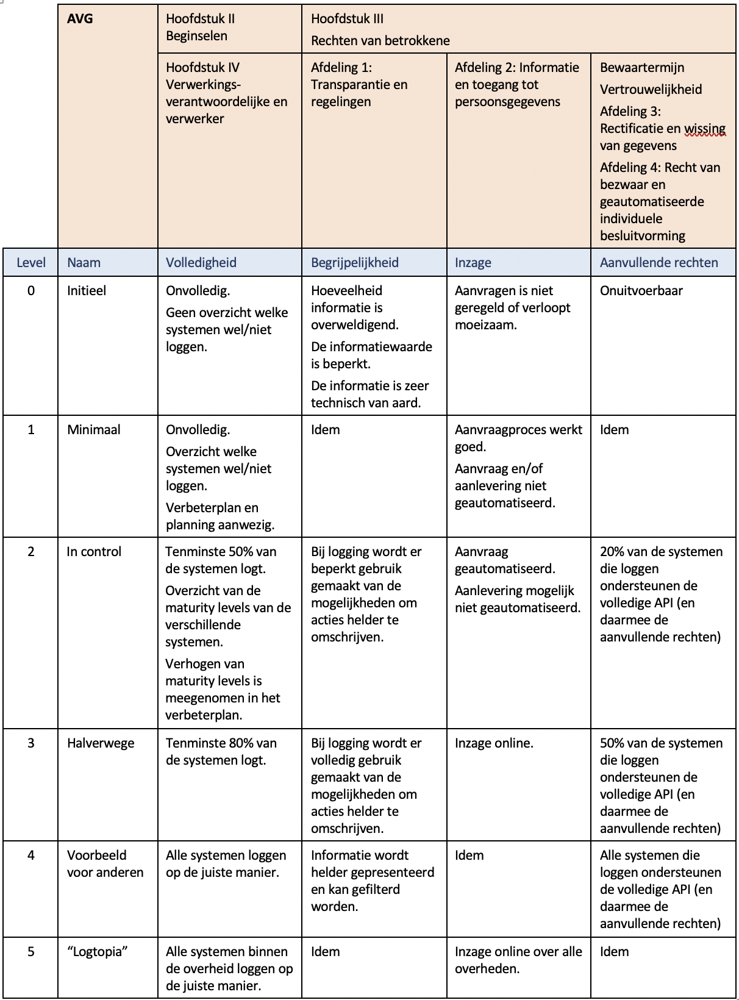
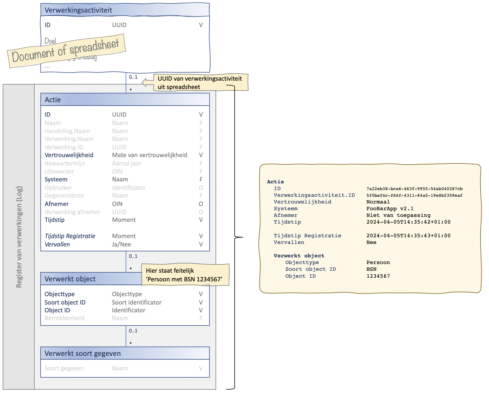

## Introductie
Logging raakt vrijwel alle systemen van de gemeenten, de communicatie tussen die systemen en speelt ook nog eens een rol in de communicatie met andere partijen. Belangrijk uitgangspunt bij het ontwerp van deze standaard is daarom dat systemen en partijen in hun eigen tempo logging moeten kunnen realiseren.
De standaard is zo opgezet dat systemen maximaal ontkoppeld zijn. Hierdoor kunnen alle partijen, onafhankelijk van elkaar, werken aan de realisatie en implementatie. Zie hiervoor ook de toelichting in [B7259](../../achtergronddocumentatie/ontwerp/artefacten/7259.md) (*Loggen aan beide kanten van een API*). 

Gemeenten, systemen, leveranciers en derden zullen de komende jaren allemaal in een verschillend stadium verkeren t.a.v. het implementeren van logging. Het lijkt goed om in een dashboard bij te gaan houden hoe gemeenten en de gemeentelijke software ervoor staan. Hierbij zou gebruik gemaakt kunnen worden van een Logging Maturity Level.

## Voorbeeld
Hieronder is een eerste aanzet voor een Logging Maturity Level gegeven.
Waarschijnlijk zijn er uiteindelijk twee aparte schema’s nodig. Eén voor de totale inrichting van de gemeente en één voor de capabilities van gemeentelijke software. Formuleringen zijn onvoldoende SMART en zo zijn er vast nog diverse verbeteringen denkbaar. De getoonde tabel is dus uitsluitend ter inspiratie.

Verdere uitwerking en aanscherping, hiervan valt niet binnen de huidige scope.

## Minimale versus maximale logging
Onderstaande afbeelding toont logging in zijn meest basale vorm.

-	Het gemeentelijk VAR is geen informatiesysteem maar een document of spreadsheets. De verwerkingsactiviteiten in het VAR zijn al wel voorzien van een uniek ID ([UUID](../../gegevenswoordenboek/attribuuttypen/UUID.md)) zodat er vanuit het log naar het VAR verwezen kan worden.
-	Vanuit de gedachte ‘beter iets dan niets loggen’ worden van het [uitwisselingsgegevensmodel](../uitwisselingsgegevensmodel/readme.md) alleen de meest basale attributen gebruikt. Dit zal niet leiden tot een voor de burger begrijpelijk log maar het is een begin en beter dan niets.

Ter vergelijking laat onderstaande afbeelding een voorbeeld zien van het maximale gebruik van logging.

-	Het VAR is een informatiesysteem.
-	Van het [uitwisselingsgegevensmodel](../uitwisselingsgegevensmodel/readme.md) worden alle attributen gebruikt. Dit zal leiden tot een veel begrijpelijker log voor de burger.
-	Bij volledige implementatie van de API is het nu mogelijk om:
    - Bewaartermijnen die later in een proces bekend worden te registreren.
    - De vertrouwelijkheid van verwerkingen op te heffen.
    - De logging over bepaalde verwerkingen logisch te verwijderen.
    - Et cetera.
    
    

