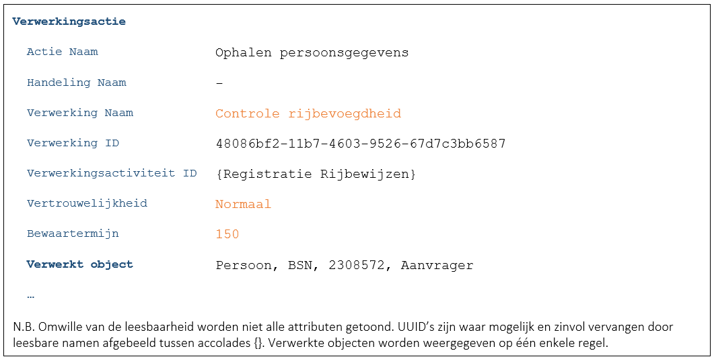
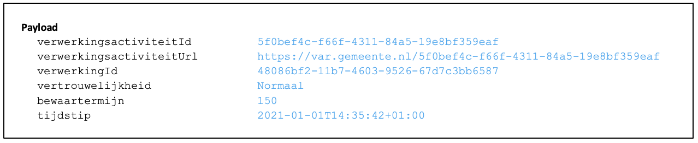
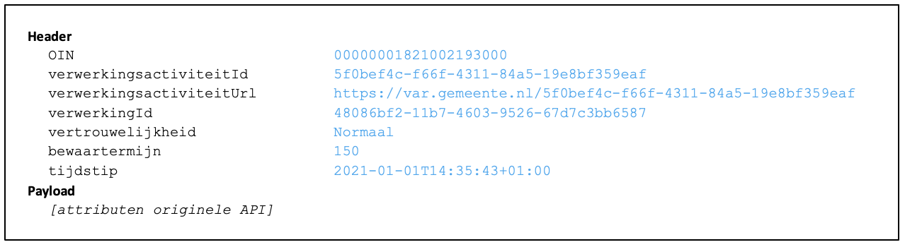
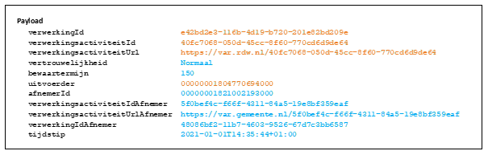

## Algemeen
In deze casus worden gegevens opgevraagd bij een derde partij. 
De situatie is eigenlijk de inverse van [C2866](./2866.md) waarin een derde partij de gemeente bevraagt. 

## Zaaksysteem/scherm
Applicatie toont bepaalde gegevens die nodig zijn voor de afhandeling van de zaak. Deze gegevens zijn verkregen door een derde partij te bevragen.
- De applicatie logt (F7446):

    

-	De applicatie bevraagt nu de externe partij (de RDW in dit voorbeeld) en geeft in de header van de API-aanroep de volgende informatie mee (B9177):
    - OIN van de gemeente
    - ID van de verwerking
    - Vertrouwelijkheid van de verwerking
    - Bewaartermijn van de verwerking
-	Ook de derde partij dient te loggen ([B7259](./7259.md)) dit valt echter buiten de verantwoordelijkheid van de aanroepende partij.

## Architectuurschets
Onderstaande architectuurschets geeft weer hoe bij het opvragen van gegevens bij een derde partij omgegaan moet worden met de logging van verwerkingen en het doorgeven van meta-attributen ten behoeve van deze logging. Het is een extra toelichting op de uitleg hoe gegevensuitwisseling tussen twee organisaties verloopt en welke gegevens er meegegeven moeten worden bij het aanroepen van de verschillende API’s.

In bovenstaand voorbeeld zijn twee organisaties betrokken: een gemeente en de RDW. Een medewerker van de gemeente werkt in de applicatie Burgerzaken en vandaaruit vraagt de medewerker ten behoeve van een ‘Controle belemmering uitreiking’ een aantal gegevens op uit het Centraal Rijbewijzenregister bij de RDW.
Per gegevensuitwisseling wordt in onderstaande opsomming in kleur aangeven waar de gegevens vandaan komen. De blauwe kleur zijn gegevens van de gemeente, de oranje kleur geeft aan dat de gegevens van de RDW zijn.

### Toelichting bij de nummers
1.	De burgerzakenapplicatie bepaalt het `verwerkingsactiviteitID` van de verwerkingsactiviteit `Registratie Rijbewijzen`. De applicatie kan dit bijvoorbeeld bepalen door een intern Verwerkingenregister (tabel) van de applicatie te raadplegen;

2.	Voordat de gemeente gegevens bij de RDW ophaalt, wordt de verwerkingsactie `Ophalen persoonsgegevens` vastgelegd in de Verwerkingenlog van de gemeente. De gegevens die minimaal geregistreerd moeten worden, worden meegegeven in de payload van het bericht. Bij het loggen van gegevens worden geen logging attributen in de html header meegegeven.

    

3.	De Verwerkingenlog controleert bij de Autorisatie component of de Burgerzaken applicatie de API van de Verwerkingenlog mag benaderen. Dit wordt gecontroleerd aan de hand van de scope die is meegegeven in de JWT-claim met de aanroep vanuit de Burgerzaken applicatie aan de Logging API. Als de autorisatiescope `create.normal` betreft - waarbij de loggegevens niet vertrouwelijk geregistreerd hoeven te worden - wordt deze stap overgeslagen. Bij de andere autorisatiescope `create.confidential` wordt deze stap wél uitgevoerd.

4.	Als de actie gelogd is, benadert de applicatie Burgerzaken de API van de RDW. Omdat het Centraal Rijbewijzenregister gegevens namens de gemeente gaat ophalen, wordt een aantal gegevens over de verwerking vanuit de gemeente in de html header van de API aan de RDW meegegeven ten behoeve van de logging bij de RDW. De payload bevat alleen attributen die horen bij de originele API en zijn niet van belang voor de logging.

    

5.	Het Centraal Rijbewijzenregister bepaalt het `verwerkingsactiviteitID` van (bijvoorbeeld) de verwerkingsactiviteit `Rijbewijsgegevens leveren aan gemeente`. De applicatie kan dit bijvoorbeeld bepalen door een intern Verwerkingenregister (tabel) van het register te raadplegen;

6.	Voordat de RDW de gegevens aan de gemeente aanlevert, wordt de actie vastgelegd in de Verwerkingenlog van de RDW. Omdat het Centraal Rijbewijzenregister gegevens ophaalt ten behoeve van de gemeente, worden er ook gegevens van de gemeente vastgelegd. De gegevens van de gemeente worden overgenomen uit de attributen uit de html header die de gemeente heeft meegestuurd bij het benaderen van de API van het Centraal Rijbewijzenregister (zie stap 4). De gegevens die minimaal geregistreerd worden, worden meegegeven in de payload van het bericht.

    

7.	De Verwerkingenlog controleert bij de Autorisatie component of het Centraal Rijbewijzenregister de API van de Verwerkingenlog wel mag benaderen. Dit wordt gecontroleerd aan de hand van de scope die is meegegeven in de JWT-claim met de aanroep vanuit het Centraal Rijbewijzenregister aan de Logging API. Als de autorisatiescope `create.normal` betreft - waarbij de loggegevens niet vertrouwelijk geregistreerd hoeven te worden - wordt deze stap overgeslagen. Bij de andere autorisatiescope `create.confidential` wordt deze stap wél uitgevoerd.

