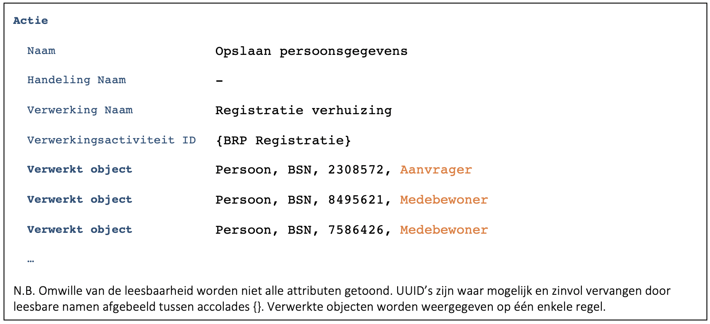

## Algemeen
Deze case is een variant op [C9172](./9172.md). Alleen de verschillen worden beschreven.
In deze case heeft de verwerking daadwerkelijk betrekking op meerdere burgers. De personen zijn niet ‘per ongeluk’ betrokken zoals in [C4081](./4081.md) waarin werd gezocht op achternaam en geboortedatum.

## Scherm ‘Registratie verhuizing’
### Medewerker voert BSN van de burger in
### Applicatie haalt ‘NAW gegevens’ van de burger en **medebewoners** op en toont deze
-	De gelogde actie (F7446):

### Persoonsgegevens worden aangepast en opgeslagen
-	De gelogde actie (F7446):

