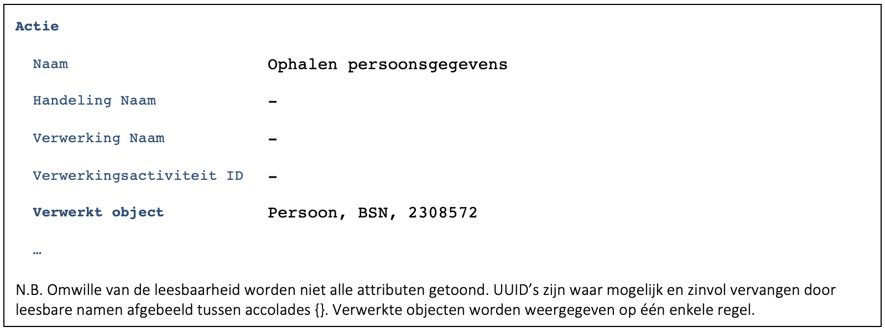
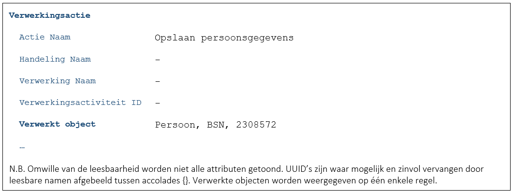
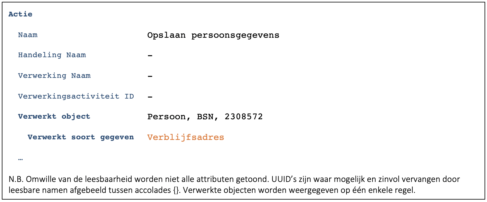

Deze case is een variant op [C9172](./9172.md). Alleen de verschillen worden beschreven.
In deze case werkt de medewerker met een systeem dat geen aparte functionaliteit biedt voor het registreren van een verhuizing. Gevolg is dat er met een generiek scherm gewerkt wordt waarop alle persoonsgegevens te zien en aan te passen zijn.

## Opmerking bij de casus
Het voorbeeld lijkt niet te voldoen aan de ‘Beginselen inzake verwerking van persoonsgegevens’ uit de AVG. Artikel 5.1.c stelt namelijk: 

> Persoonsgegevens moeten toereikend zijn, ter zake dienend en beperkt tot wat noodzakelijk is voor de doeleinden waarvoor zij worden verwerkt (“minimale gegevensverwerking”). 

Het voorbeeld is uitgewerkt voor systemen die toch nog zo werken. Daarbij kennen sommige systemen generieke schermen voor expert gebruikers. Hiermee wordt voorkomen dat processen en schermen uitgedacht moeten worden voor uitzonderlijke situaties. Daarmee blijft de essentie van deze casus relevant.

## Scherm ‘Persoonsgegevens’
### Medewerker voert BSN van de burger in
### Applicatie haalt ‘alle’ gegevens van de burger op en toont deze
- Idealiter worden dit soort schermen/applicaties aangepast om voor het ophalen van de persoonsgegevens aan de medewerker te vragen wat de reden is van de opvraging. Indirect vragen we daarmee natuurlijk naar één van de toegestane verwerkingsactiviteiten. Op die manier zou er toch een specifieke verwerkingsactiviteit gelogd kunnen worden. We gaan er in dit voorbeeld echter vanuit dat dat niet mogelijk is. 
- Het opvragen van gegevens wordt gelogd (F7446):

-	Het is in dit geval onmogelijk om de actie te koppelen aan een verwerkingsactiviteit.
    -	Het heeft sterk de voorkeur om de actie toch te kunnen relateren aan een verwerkingsactiviteit. Wellicht kunnen er voor dit soort applicaties aparte verwerkingsactiviteiten in het gemeentelijk VAR gemaakt worden. Dit van uit de gedachte ‘beter enige traceerbaarheid dan geen enkele’.
- Het is in dit geval onmogelijk om de getoonde gegevens door de opname van Verwerkt soort gegeven nader in te perken. Ze zijn immers allemaal getoond ([B6247](/.6247.md)). 

### Persoonsgegevens worden aangepast en opgeslagen
-	Het is goed mogelijk dat de applicatie geen idee heeft welke gegevens aangepast zijn. Als de medewerker voor ‘opslaan’ kiest, worden wellicht alle gegevens opgeslagen. In een dergelijk geval is er dus niet bekend welke gegevens gewijzigd zijn en wordt het volgende gelogd (F7446):

-	Het zou echter ook kunnen zijn dat de applicatie wel bepaalt welke gegevens gewijzigd zijn. In dat geval zouden deze gegevens geduid kunnen worden in het log ([B6247](./6247.md), [B4555](./4555.md)):

