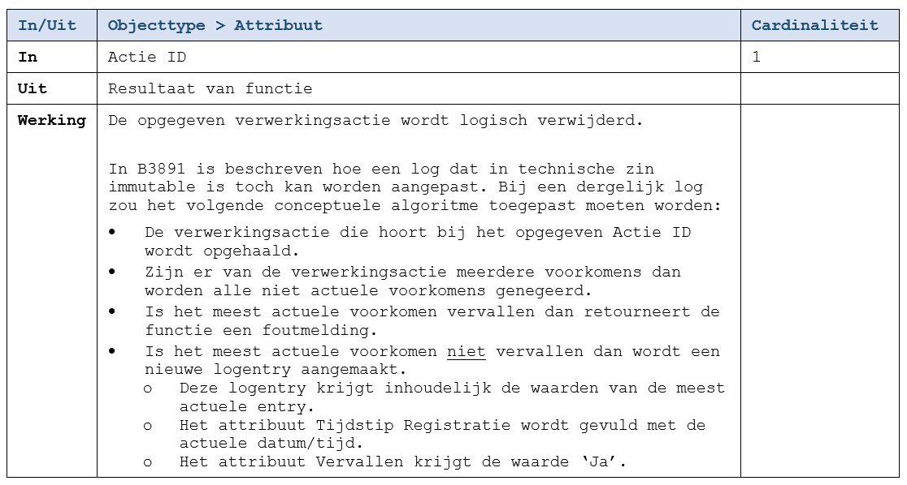

De functie markeert de opgegeven vertrouwelijke [actie](../../../gegevenswoordenboek/objecttypen/Actie.md) als vervallen. Hierdoor zal deze niet meer geretourneerd worden door de vertrouwelijke inzage-functies van de logging API. De interface van deze functie is identiek aan die van [F9906](./9906.md).

