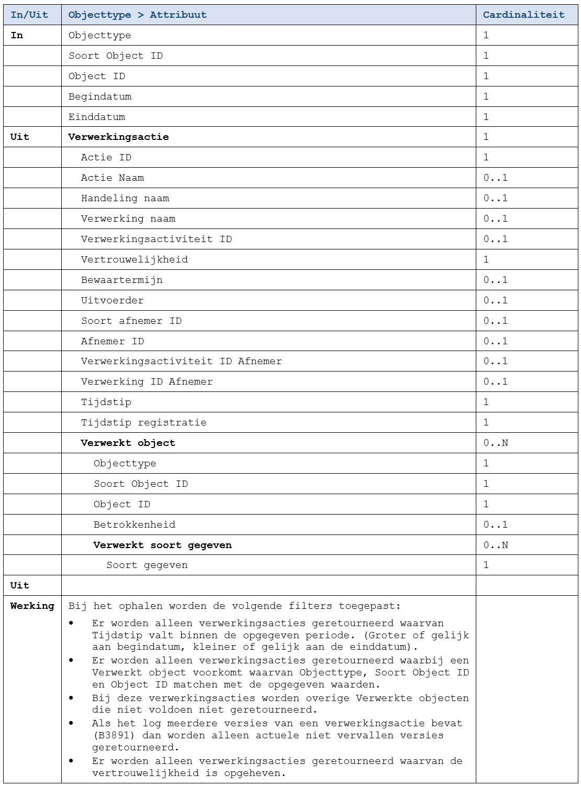

De functie retourneert alle [Verwerkingsacties](../../../gegevenswoordenboek/objecttypen/Verwerkingsactie.md) die over de opgegeven persoon gelogd zijn in de opgevraagde periode. De functie retourneert alleen verwerkingsacties waarvan de vertrouwelijkheid is opgeheven en retourneert van die acties niet alle attributen. 

