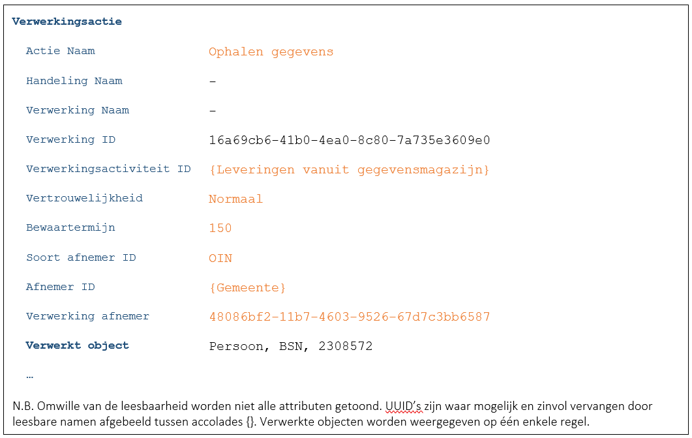
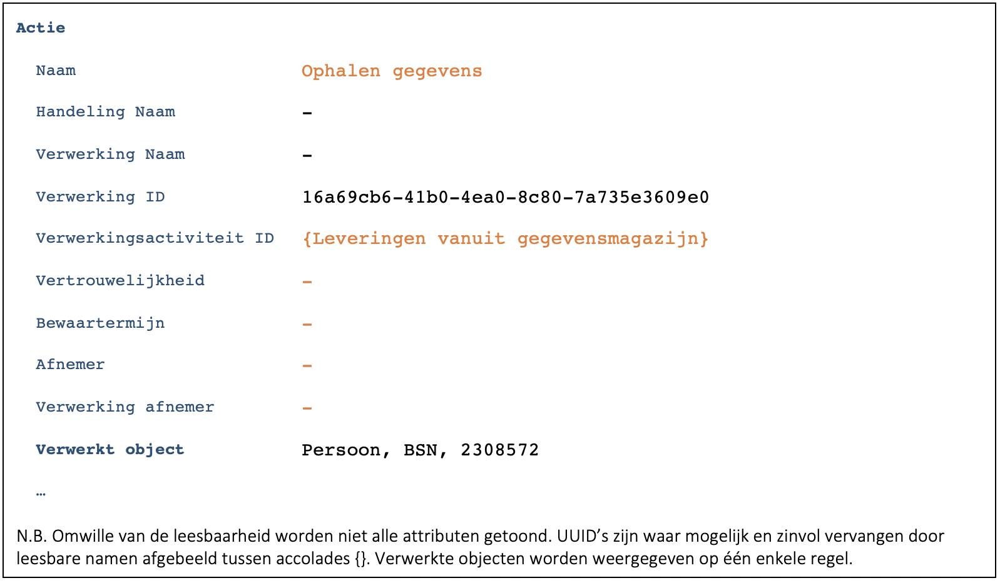
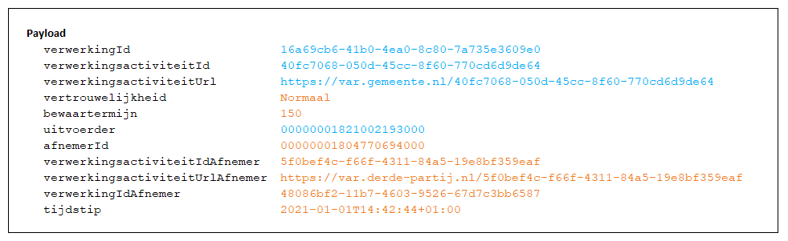

Deze case is een variant op [C9522](./9522.md). 

De gemeente treedt in deze casus op als een provider van gegevens en ontvangt een verzoek van een geautoriseerde derde partij.

## Extern systeem
#### Externe applicatie toont bepaalde gegevens die opgevraagd worden bij de gemeente
-	De externe applicatie dient deze verwerking te loggen ([B7259](./7259.md)). Als de derde partij een gemeente is dan verloopt dit zoals beschreven in [C9522](./9522.md). 
-	De externe applicatie roept na het loggen de verwerkingenlogging API van de gemeente aan.
-	Vanuit de gemeente als provider gezien zijn er twee mogelijke situaties:

**Situatie 1:** 

In de header van de API-aanroep wordt door de derde partij, indien deze de verwerkingenlogging API volledig heeft geïmplementeerd, de volgende informatie meegegeven ([B9177](./9177.md)):
- OIN van de consumer
- ID van de verwerking
- Vertrouwelijkheid van de verwerking
- Bewaartermijn van de verwerking
 
 De gemeente logt dan in haar rol van provider het volgende (F7446):
    
 

 Toelichting:
 - De vertrouwelijkheid van de derde partij wordt overgenomen in het attribuut [Vertrouwelijkheid](../../../gegevenswoordenboek/attributen/Vertrouwelijkheid.md)
 - De bewaartermijn van de derde partij wordt overgenomen in het attribuut [Bewaartermijn](../../../gegevenswoordenboek/attributen/Bewaartermijn.md).
 - Het OIN van de derde partij wordt overgenomen in het attribuut [Afnemer ID](../../../gegevenswoordenboek/attributen/Afnemer_ID.md) ([B9330](./9330.md)). 
 - Het ID van de verwerking van de derde partij wordt overgenomen in [Verwerking ID afnemer](../../../gegevenswoordenboek/attributen/Verwerking_ID_Afnemer.md).

**Situatie 2:** 

De derde partij heeft de verwerkingenlogging API niet volledig geïmplementeerd.Er wordt geen aanvullende informatie meegegeven in de header van de API. De gemeente logt dan in haar rol van provider het volgende (F7446):
    

    
Toelichting:
-	In deze situatie is er feitelijk geen sprake meer van verantwoording over de uitgevoerde verwerking.
-	Als de provider hier (eenzijdig) hier iets aan wil doen dan is het zaak om de (autorisatie van de) afnemer te koppelen aan een zo specifiek mogelijk verwerkingsactiviteit in het VAR. 

## Architectuurschets
Onderstaande architectuurschets geeft weer hoe bij het opvragen van gegevens door een derde partij omgegaan moet worden met de logging van verwerkingen en het doorgeven van meta-attributen ten behoeve van deze logging. Het is een extra toelichting op de uitleg hoe gegevensuitwisseling tussen een derde partij en een gemeente verloopt en welke gegevens er meegegeven moeten worden bij het aanroepen van de verschillende API’s.

### Toelichting
In bovenstaande voorbeeld zijn twee organisaties betrokken: een gemeente en een derde partij. Een medewerker van de derde partij werkt in de procesapplicatie en vandaaruit vraagt de medewerker ten behoeve van het `Tonen persoonsgegevens` een aantal gegevens op uit bijvoorbeeld het Gegevensmagazijn bij de gemeente. Hoewel het toepassen van de standaard niet kan worden afgedwongen bij de derde partij, wordt - omwille van dit voorbeeld - aangenomen dat de standaard wel bij de derde partij is geïmplementeerd. Per gegevensuitwisseling wordt in onderstaande opsomming in kleur aangeven waar de gegevens vandaan komen. De blauwe kleur zijn gegevens van de gemeente, de oranje kleur geeft aan dat de gegevens van de derde partij zijn.

### Toelichting bij de nummers
1.	De procesapplicatie bepaalt het verwerkingsactiviteitID van de verwerkingsactiviteit `Tonen persoonsgegevens`. De procesapplicatie kan dit bijvoorbeeld bepalen door een intern Verwerkingenregister (tabel) van de applicatie te raadplegen.

2.	Voordat de derde partij gegevens bij de gemeente ophaalt, wordt de verwerkingsactie `Ophalen persoonsgegevens bij gemeente` vastgelegd in de Verwerkingenlog van de derde partij. De gegevens die minimaal geregistreerd moeten worden, worden meegegeven in de payload van het bericht. Bij het loggen van gegevens worden geen logging attributen in de http header meegegeven.

    
    
 3.	De Verwerkingenlog controleert bij de Autorisatie component of de procesapplicatie geautoriseerd is voor het gebruik van de API voor het toevoegen van verwerkingenlog gegevens. Dit wordt gecontroleerd aan de hand van de scope die is meegegeven in de JWT-claim met de aanroep vanuit de externe applicatie aan de Verwerkingenlogging API. Als de autorisatiescope `create.normal` betreft - waarbij de loggegevens niet vertrouwelijk geregistreerd hoeven te worden - wordt deze stap overgeslagen. Bij de andere autorisatiescope `create.confidential` wordt deze stap wél uitgevoerd.
 
4.	Als de actie door de Verwerkingenlog is gelogd, benadert de procesapplicatie de API van de gemeente. Omdat het Gegevensmagazijn gegevens namens de derde partij gaat leveren, wordt een aantal gegevens over de verwerking vanuit de derde partij in de http header van de API aan de gemeente meegegeven ten behoeve van de logging bij en door de gemeente. De payload (inhoud van het bericht) bevat alleen attributen die horen bij de te bevragen API en zijn niet van belang voor de logging. Uiteraard heeft de gemeente een informatiesysteem om te controleren of de derde partij überhaupt wel gegevens bij de gemeente mag ophalen (authenticatie en autorisatie). Dit informatiesysteem is vanwege de leesbaarheid van de schets achterwege gelaten.

    

5.	Het Gegevensmagazijn bepaalt het gemeentelijk ‘verwerkingsactiviteitID’ van (bijvoorbeeld) de verwerkingsactiviteit `Persoonsgegevens leveren aan derde partij`.
6.	Voordat de gemeente de gegevens aan de derde partij levert, wordt de actie vastgelegd in de Verwerkingenlog van de gemeente. Omdat het Gegevensmagazijn gegevens levert ten behoeve van de derde partij, worden er ook gegevens van de derde partij vastgelegd. De gegevens van de derde partij worden overgenomen uit de attributen uit de http header die de derde partij heeft meegestuurd bij het benaderen van de API van het Gegevensmagazijn (zie stap 4). De gegevens die minimaal geregistreerd worden, worden meegegeven in de payload van het bericht.

    
    
7.	De Verwerkingenlog controleert bij de Autorisatie component of het Gegevensmagazijn de API van de Verwerkingenlog wel mag benaderen. Dit wordt gecontroleerd aan de hand van de scope die is meegegeven in de JWT-claim met de aanroep vanuit het Gegevensmagazijn aan de Verwerkingenlogging API. Als de autorisatiescope `create.normal` betreft - waarbij de loggegevens niet vertrouwelijk geregistreerd hoeven te worden - wordt deze stap overgeslagen. Bij de andere autorisatiescope `create.confidential` wordt deze stap wél uitgevoerd.
