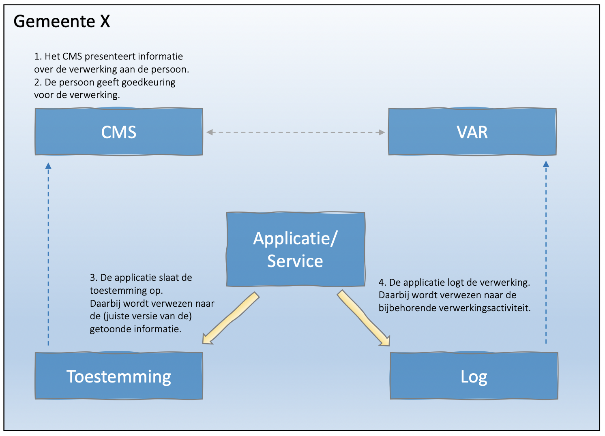

## Situatie

In het brondocument *GEMMA Gegevenslandschap - Register van verwerkingsactiviteiten* wordt gesteld dat:

> _Indien de gemeente (persoons)gegevens verwerkt gebaseerd op een toestemming van de betrokken persoon dan dient de gemeente onder de Algemene verordening gegevensbescherming (AVG) aan de Autoriteit Persoonsgegevens (AP) kunnen laten zien dat die toestemming daadwerkelijk van toepassing was op het moment van de verwerking._
    
Hierop wordt in het document nog nadere detaillering aangebracht:

> _3.6.1. Specifiek en geïnformeerd - Twee van de eisen die de AVG stelt aan ‘toestemming’ zijn dat deze ‘geïnformeerd’ en ‘specifiek’ gegeven is. Om geldige toestemming aan te tonen is het dan ook essentieel dat de gemeente kan aantonen op basis van welke informatie de betrokken personen de toestemming hebben gegeven. Het is dus onvoldoende om alleen de toestemming zelf vast te leggen.
> 3.6.2. Herleidbaarheid - De gemeente moet ervoor zorgen dat voldoende data beschikbaar is waarmee een link tussen de verwerking én de toestemming van een betrokkene aangetoond kan worden. Let wel, hierbij mag niet méér data verzameld worden dan strikt noodzakelijk is om geldige toestemming aan te kunnen tonen.
> 3.6.3. Online toestemming - Wanneer online toestemming is gevraagd aan burgers voor het verwerken van hun persoonsgegevens dan dient de informatie over het websitebezoek, waarin zij de toestemming hebben gegeven, vastlegd te worden. Deze informatie dient gecombineerd te worden met:
>    - documentatie over het proces waarin is vastgelegd op welke manier toestemming ontvangen en vastgelegd wordt.
>    - een kopie van de informatie die de betrokkenen hebben ontvangen voorafgaand aan de gegeven toestemming.
> Verwijzen naar een automatische registratie van toestemming door de website is onvoldoende om geldige toestemming aan te kunnen tonen. De informatie die aan de betrokkenen is verstrekt, ontbreekt dan namelijk._

## Besluit
De toestemming wordt niet vastgelegd in het log.

## Toelichting
Het proces is uitgewerkt in onderstaande afbeelding.

-	Het VAR en het CMS kunnen een directe relatie hebben, maar dit is niet noodzakelijk. De registratie van de verleende toestemming is een verwerking die gelogd dient te worden. De daadwerkelijke toestemming is een persoonsgegeven en hoort niet thuis in het log.
-	De AVG eist dat er documentatie is over het proces waarin is vastgelegd op welke manier toestemming ontvangen en vastgelegd wordt. Dit is ofwel een bijlage van het VAR of onderdeel van het CMS.
-	De AVG eist dat er een kopie is van de informatie die de betrokkenen hebben ontvangen voorafgaand aan de gegeven toestemming. Dit vereist dus een duurzaam toegankelijk  CMS.

