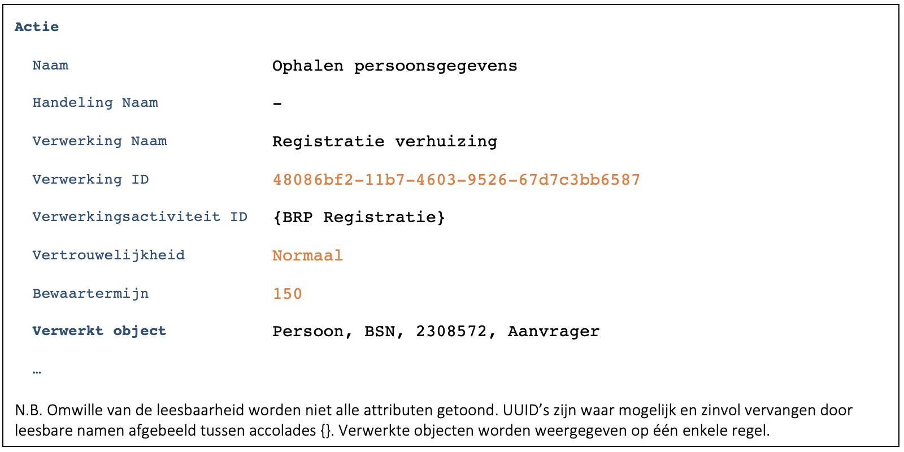
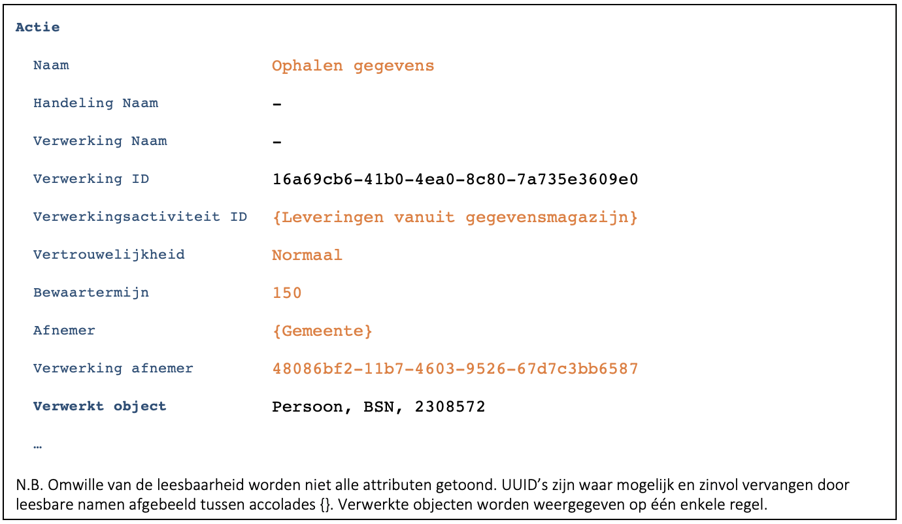

## Algemeen
Deze case is een variant op [C9172](./9172.md). Alleen de verschillen worden beschreven.
De stappen zijn identiek. Verschil is dat er niet direct met de (relationele) database gecommuniceerd wordt maar dat alles verloopt via de (Restful) API. 

We gaan er in deze casus vanuit dat de services benaderbaar zijn vanuit verschillende applicaties. In dat geval dient er namelijk zowel door de applicatie (consumer) als door de service (provider) gelogd te worden ([B7259](./7259.md)).

Bestaat een applicatie uit een verzameling microservices dan is het de vraag of iedere microservice moet loggen. Het antwoord op deze vraag is afhankelijk van de karakteristieken van de gekozen architectuur. Enkele aspecten die hierbij een rol kunnen spelen: 
-	Gedragen de microservices zich als één applicatie?
-	Zijn de microservices te gebruiken door meerdere ‘applicaties’?
-	Is de gegevensverwerking voldoende transparant om verantwoording af te leggen? 
-	Blijft het log begrijpelijk voor de burger?

## Scherm ‘Registratie verhuizing’
### Medewerker voert BSN van de burger in
- Identiek aan basis case.

### Applicatie haalt ‘NAW gegevens’ van de burger op en toont deze
- De applicatie logt (F7446):

    
-	De service logt (F7446):
    

    
- Consumer (applicatie) en provider (service) loggen hun eigen verwerking ([B7259](./7259.md)).
- Iedere verwerking is gebaseerd op de bijbehorende verwerkingsactiviteit. Dit zijn **niet** dezelfde verwerkingsactiviteiten.
- 	De provider heeft informatie nodig van de consumer om goed te kunnen loggen. Deze informatie wordt bij aanroep van de API in de header meegegeven ([B9177](./9177.md)). Het gaat daarbij om de volgende informatie:
    - `OIN van de consumer`
    - `ID van de verwerking`
    - `Vertrouwelijkheid van de verwerking`
    - `Bewaartermijn van de verwerking`
- De provider logt de vertrouwelijkheid en de bewaartermijn.
- De provider logt de afnemer ([B9330](./9330.md)). In deze casus is dat de gemeente zelf (binnengemeentelijke levering). 
- Het ID van de verwerking van de consumer wordt bij de provider overgenomen in Verwerking afnemer.

### Persoonsgegevens worden aangepast en opgeslagen
- Identiek aan het hiervoor beschreven patroon.

## Foutafhandeling
Geen bijzonderheden.

    

