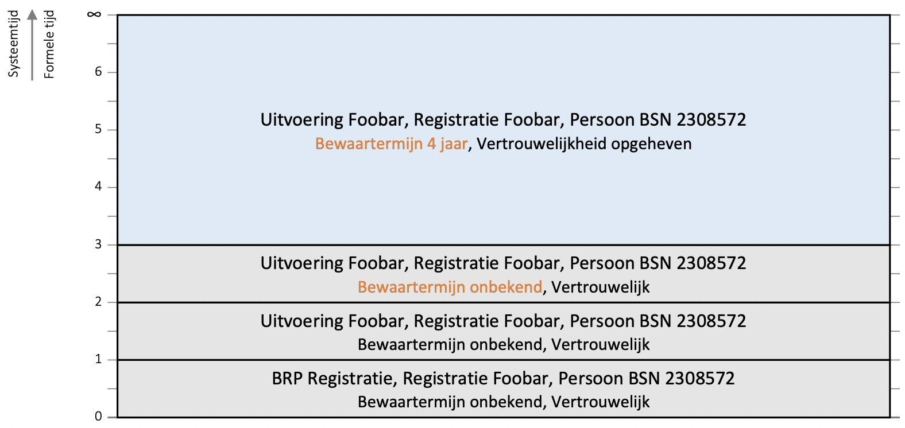
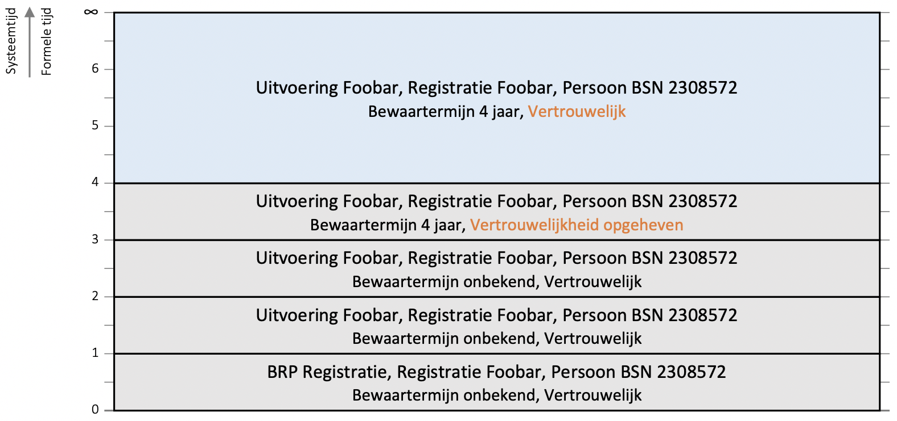
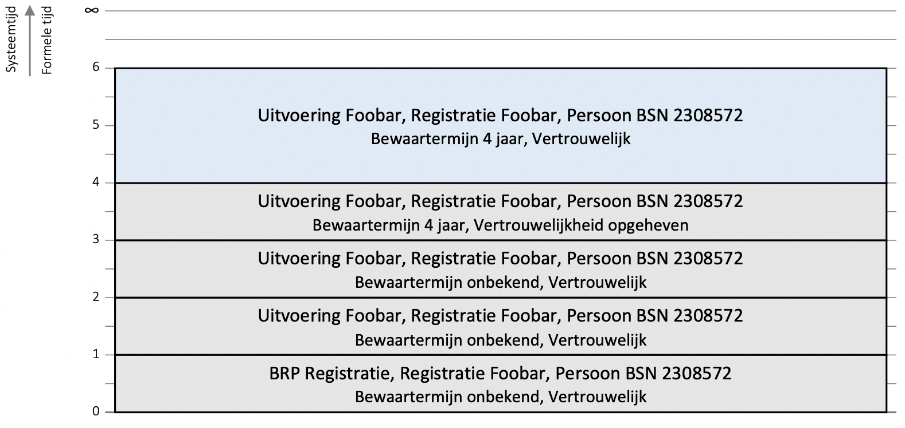
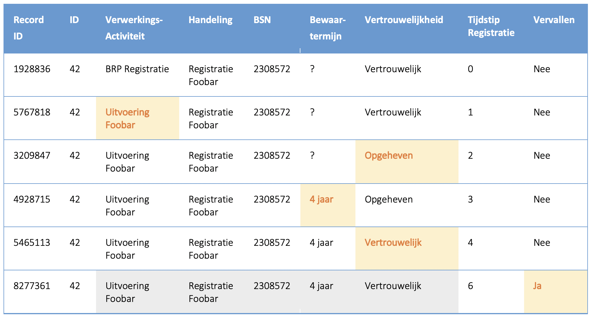

## Besluit
- Het Log is fysiek onwijzigbaar (immutable)
    - Er mogen geen record gewist of gemuteerd worden .
    - Er mogen wel records toegevoegd worden.
-	Het log is logisch muteerbaar
-	Wijzigingen dienen traceerbaar te zijn
    - Van logentries dient formele historie bijgehouden te worden

In de toelichting is uitgewerkt hoe het formele historie patroon geïmplementeerd kan worden zonder records te muteren.

## Toelichting
De hieronder getoond uitwerking is absoluut **geen** implementatievoorschrift. Het beschreven patroon is een controle of de genomen besluiten in samenhang implementeerbaar zijn uitgaande van een immutable log. Het is aan een leverancier om een besluit te nemen over toepassing van dit patroon.

We beschouwen een verwerking die we bewust allerlei wijzigingen laten ondergaan. We beginnen met de initiële entry:

Op de y-as is te zien dat de entry in het systeem geregistreerd is op t=0.
Betekenis van de informatie van links naar rechts:
-	Verwerkingsactiviteit = `BRP Registratie`
-	Handeling = `Registratie Foobar`
-	Betrokken persoon: `BSN 2308572`
-	Bewaartermijn: `Onbekend`
-	Vertrouwelijkheid: `Vertrouwelijk`

Bij de configuratie van de software is iets verkeerd gegaan. Daardoor verwijst de verwerking naar de verkeerde verwerkingsactiviteit.

Op t=1 wordt een nieuwe entry opgenomen waarin de verwerkingsactiviteit gecorrigeerd is.

Op t=2 wordt de vertrouwelijkheid opgeheven.

Op t=3 wordt de bewaartermijn vastgelegd. 

Op t=4 wordt de entry opnieuw vertrouwelijk gemaakt.

Op t=6 wordt de entry logisch verwijderd.

Op basis van een log waarin alleen nieuwe records toegevoegd mogen worden zou dit op onderstaande wijze geïmplementeerd kunnen worden:

Toelichting van links naar rechts:
-	Record ID: Technisch ID dat het systeem gebruikt om de records uit elkaar te houden. Gebruikte nummers/format is slechts een voorbeeld en niet relevant.
-	ID: Logische identificator van de verwerking. Hoort volgens het gegevensmodel een UUID te zijn. Dat werd een beetje te groot, daarom afgekort tot 42.
-	Verwerkingsactiviteit: Dit is normaal gesproken het UUID van de verwerkingsactiviteit. Omwille van de leesbaarheid is die vervangen door de naam.
-	Handeling: Door systeem uitgevoerde handeling.
-	BSN: Dit is eigenlijk het objecttype [Verwerkt object](../../../gegevenswoordenboek/objecttypen/Verwerkt_object.md) waarbij in het veld [Objecttype](../../../gegevenswoordenboek/attributen/Objecttype.md) ‘persoon’ staat, in het veld [Soort Object ID](../../../gegevenswoordenboek/attributen/Soort_object_ID.md) ‘BSN’ en als [Object ID](../../../gegevenswoordenboek/attributen/Object_ID.md) het daadwerkelijke BSN. Omwille van de leesbaarheid ingekort tot alleen het BSN.

