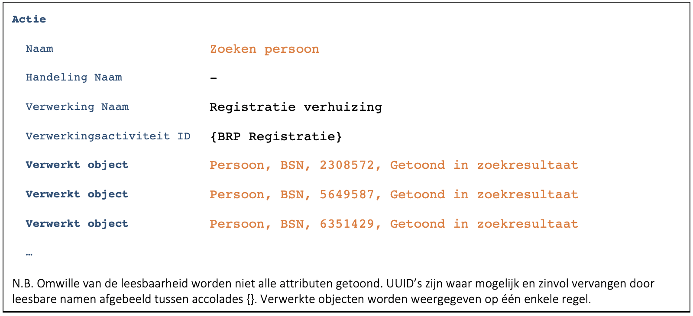

Deze case is een variant op [C9172](./9172.md). Alleen de verschillen worden beschreven.

Essentie van deze case is dat we de BSN van de burger niet weten. Om de burger toch van dienst te zijn zoeken we deze op basis van de eerste letters van de achternaam en de geboortedatum. 

## Opmerking bij de casus
Dit voorbeeld komt in de praktijk nog regelmatig voor. Het lijkt niet te voldoen aan de ‘Beginselen inzake verwerking van persoonsgegevens’ uit de AVG. Artikel 5.1.c stelt namelijk: 

> Persoonsgegevens moeten toereikend zijn, ter zake dienend en beperkt tot wat noodzakelijk is voor de doeleinden waarvoor zij worden verwerkt (“minimale gegevensverwerking”). 

Bij dit soort burgerzakenprocessen bestaat een identificatieplicht. Alle identificatie/legitimatie bewijzen zijn voorzien van een BSN. Er lijkt dus geen reden om in dergelijke situaties het BSN niet te gebruiken. Er zijn echter wel situaties denkbaar waarin een zoekopdracht de enige manier is om de identiteit van een betrokkene te achterhalen. Daarmee blijft de essentie van deze casus relevant.

-	Medewerker zoekt de burger op basis van een deel van de achternaam en de geboortedatum
    - Er zijn meerdere personen die aan het opgegeven zoek criterium zouden kunnen voldoen. Het is daardoor niet mogelijk om eerst te loggen en dan pas de actie uit te voeren. We krijgen daardoor bij zoekopdrachten een iets andere flow:
    - (1) De zoekopdracht wordt uitgevoerd.
    - (2) De zoekopdracht wordt gelogd (F7446):
    
    
    
    - In de actie zien we in dit geval meerdere verwerkte objecten ([B7571](./7571.md)). Dat zijn de gevonden personen.
    - Bij de personen vermelden we als betrokkenheid: ‘Getoond in zoekresultaat’ ([B1598](./1598.md)).
        - Het niet vermelden van de betrokkenheid kan tot verwarring leiden bij de personen die niet verhuisd zijn. 
        - Bij een gevoelige verwerking zoals een fraudeonderzoek kan het weglaten zelfs onterecht de indruk wekken dat iemand in een onderzoek betrokken is geweest.
        - Vanuit privacy by design wordt bewust niet aangegeven welke persoon geselecteerd is. Mocht er ooit iets misgaan met de filtering en iemand krijgt onbedoeld alle personen bij de actie te zien, dan is daaruit niet af te leiden wie geselecteerd is.
    - (3) De resultaten van de zoekopdracht worden getoond zodat de medewerker de juiste persoon kan kiezen.
        - Als het niet lukt om de actie te loggen, mogen de zoekresultaten niet getoond worden ([B7952](./7952.md)).
    - De selectiecriteria van de zoekopdracht worden niet gelogd ([B0233](./0233.md)).
    
-	Selecteren persoon
    - Het selecteren van de persoon wordt gelogd (F7446):
    
    
    
    - Het is de vraag of het selecteren van de persoon een actie is die gelogd moet worden of niet.
        - Er zijn cases denkbaar waarbij het selecteren voorlopig de enige actie is die uitgevoerd wordt. Bijvoorbeeld bij het aanleggen van een dossier over een bepaalde persoon waarbij op een later moment pas de overige acties volgen. In een dergelijke context is het loggen van de selectie noodzakelijk om te weten wat er gebeurd is.
        - Bij de verhuizing ziet de opeenvolging van de acties in log er zo uit: Zoeken persoon, Selectie persoon, Opvragen persoonsgegevens, Opslaan persoonsgegevens.
        - Zonder het loggen van de selectie wordt dat: Zoeken persoon, Opvragen persoonsgegevens, Opslaan persoonsgegevens.
        - Het loggen van de selectie leidt dus ook bij de verhuizing tot een duidelijker log.
        
-	Applicatie haalt ‘NAW gegevens’ van de burger op en toont deze
    - Identiek aan basis case.
    
-	Persoonsgegevens worden aangepast en opgeslagen
    - Identiek aan basis case.

       

