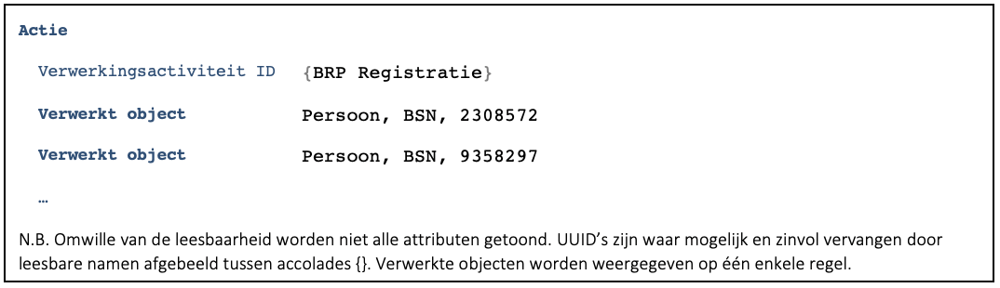
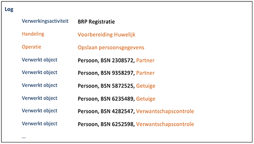

---
# A5924.md
name: A5924 - Mogelijkheden om duidelijke logentries te maken
title: "A5924 - Mogelijkheden om duidelijke logentries te maken"
layout: default
---

## Aanbeveling
Gebruik de mogelijkheden die het gegevensmodel biedt om logentries zo duidelijk mogelijk te maken:
-	Het opnemen van de naam van
    - de verwerking,
    - de handeling binnen de verwerking en
    - de operatie binnen de handeling.
-	Het bij de persoon opnemen van de betrokkenheid

Zie voor meer informatie ook de toelichting over de basisterminologie bij het [gegevensmodel](../../../gegevensmodel/index.md).

## Toelichting
Als we niet alleen naar de letter maar ook naar de geest van de AVG willen handelen, dan is het bijzonder belangrijk om burgers bij inzage een duidelijk log te kunnen presenteren. We zullen bijvoorbeeld de mogelijkheid moeten bieden om alle verwerkingen die uitgevoerd zijn door systemen weg te filteren zodat alleen de verwerkingen overblijven waarbij er een medewerker betrokken was bij de verwerking.

Duidelijkheid over de logentries zelf begint bij een goede inrichting van het VAR. Een dergelijk VAR bevat zo min mogelijk generieke en dus zoveel mogelijk specifieke verwerkingsactiviteiten. De verwerkingsactiviteiten zijn vervolgens voorzien van een duidelijk doel, grondslag en een toelichting op die grondslag.
Tot slot moeten de logentries zelf zo informatief mogelijk zijn. Hiertoe biedt het gegevensmodel diverse mogelijkheden:
- Het opnemen van de naam van de verwerking, handeling en actie.
- Het bij de persoon opnemen van de betrokkenheid.

Door al deze middelen in te zetten ontstaat een log dat bij inzage zo min mogelijk vragen oproept. Niet alleen bij de burger maar ook bij de gemeentelijk medewerker die de burger wellicht begeleidt bij de inzage.

### Voorbeelden
Bij inzage van het log treffen we de volgende actie aan. Hierbij is **geen** gebruik gemaakt van de mogelijkheden die het gegevensmodel biedt:

Bovenstaande verwerking geeft, ook na raadpleging van het VAR, feitelijk geen zinvolle informatie over de verwerking die heeft plaatsgevonden. 

Maken we wel gebruik van de mogelijkheden dan had de verwerking er bijvoorbeeld zo uit kunnen zien:

