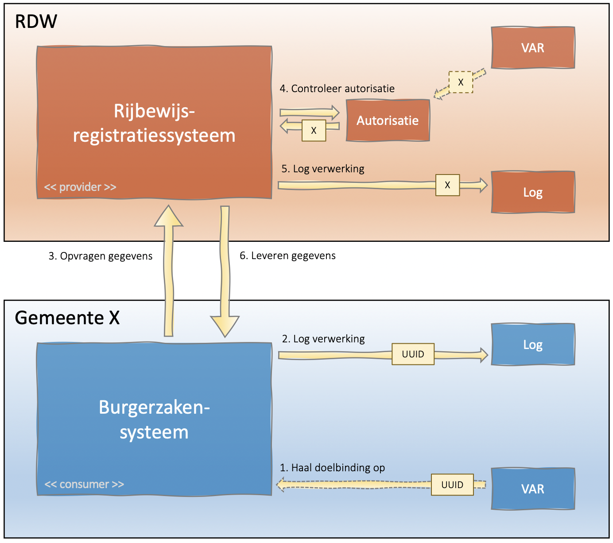

## Situatie
Bij een API die persoonsgegevens verwerkt moeten zowel de aanroepende als de afhandelende partij loggen. Ofwel:
-	Als een gemeentelijke applicatie gegevens opvraagt uit het gegevensmagazijn moeten zowel de gemeentelijke applicatie als het magazijn loggen.
-	Als een derde gegevens (via een applicatie) opvraagt bij een service van de gemeente moeten beide partijen loggen.
-	Als de gemeente bij een derde gegevens opvraagt moeten zowel de gemeente als de derde partij loggen.

## Besluit
-	Beide partijen zijn zelf verantwoordelijk voor het loggen van de verwerking.
    - Als er sprake is van twee verschillende organisaties dan loggen beide organisaties dus in hun eigen verwerkingenlog.
-	Er wordt geen informatie over de doelbinding doorgegeven via de API.
    - Voor de partij die de API ter beschikking stelt (provider) betekent dit dat de doelbinding van de aanroepende partij (consumer) al bij de provider bekend moet zijn.
    
## Toelichting
### Voorbeeld van communicatie tussen de gemeente en een derde.

N.B. Om een begrijpelijk voorbeeld te krijgen is voor rijbewijzen en dus voor het RDW gekozen. Het getoonde proces is echter niet besproken of afgestemd met het RDW.

Toelichting bij de stappen in de afbeelding:
1. Haal doelbinding op:
Concreet betekent dit dat de UUID van de verwerkingsactiviteit wordt opgehaald. Waarschijnlijk is deze in de praktijk al bij het burgerzakensysteem bekend omdat deze onderdeel is van de configuratie van het systeem.
2. Log verwerking:
Het burgerzakensysteem logt de verwerking. Uit verwerkingsactiviteit en handeling samen kan opgemaakt worden dat het bijvoorbeeld om een ‘Spoedprocedure rijbewijs’ gaat.
3. Opvragen gegevens
Het burgerzakensysteem benadert een service van de RDW en vraagt informatie op over het rijbewijs.
4. Controleer autorisatie
Het gaat hier om functionele autorisatie. Aan de ‘poort’ is al vastgesteld of we de partij kennen of het certificaat klopt etc.
Diensten die niet openbare/privacygevoelige informatie verstrekken zullen echter ook altijd moeten controleren of de aanroepende partij ook daadwerkelijk geautoriseerd is om de dienst te gebruiken. Daarbij moet de identiteit van de partij vastgesteld worden. Autorisaties zouden alleen verstrekt mogen worden als er sprake is van een geldige doelbinding. Het is dus niet vreemd als er een (logische) koppeling zou bestaan tussen het autorisatieregister en het VAR. Indien een dergelijke koppeling bestaat zou de doelbinding uit het autorisatie register gebruikt kunnen worden om te loggen.
5. Log verwerking
De RDW kan de verwerking nu loggen. 
6. Leveren gegevens

**Gevolgen van deze keuze**
-	De partijen zijn zo min mogelijk afhankelijk van elkaar bij het implementeren van de logging. Verwerkingenlog en VAR van het RDW staan immers los van het verwerkingenlog en VAR van de gemeente, zowel tijdens de registratie als bij latere raadpleging.
-	Verschillende granulariteit in de verwerkingenlogs: Omdat de doelbinding niet aan het RDW wordt doorgegeven zal het log van het RDW veel minder specifieke informatie bevatten dan het gemeentelijk verwerkingenlog. In het verwerkingenlog van de RDW staat dan bijvoorbeeld `Verstrekken van rijbewijsgegevens aan gemeenten` terwijl het gemeentelijk verwerkingenlog vermeldt `Spoedprocedure rijbewijs`.

### Voorbeeld van communicatie binnen een gemeente

Het patroon lijkt sterk op dat van de communicatie met een derde partij. Grootste verschil is dat er binnen de gemeente gebruik gemaakt kan worden van hetzelfde VAR en verwerkingenlog. Dit is overigens niet noodzakelijk maar een keuze van de gemeente. 

Ook de gevolgen zijn identiek. De systemen zijn zo onafhankelijk mogelijk in hun implementatie van verwerkingenlogging. En ook de granulariteit zal verschillen. Het gegevensmagazijn zal bijvoorbeeld `Gegevensverstrekking t.b.v. burgerzaken` loggen terwijl het burgerzakensysteem `Spoedprocedure rijbewijs` logt.

### Afgewezen alternatief: doelbinding meegeven via de API
Bij het bestuderen van verschillende scenario’s is eerst gekeken naar een scenario waarin er nauwkeuriger informatie over de doelbinding meegegeven zou worden in het request. Dit scenario is bij nadere beschouwing afgewezen. Voor de volledigheid is de essentie ervan hieronder wel opgenomen.

In stap 3 benadert het burgerzakensysteem een service van de RDW en vraagt informatie op over het rijbewijs. Aangezien ook de RDW moet loggen wordt het UUID van de verwerkingsactiviteit meegegeven.

Aangezien er geen overheidsbrede standaard is voor logging zou het zeer bijzonder zijn als de RDW iets kan met het UUID uit het VAR van de gemeente. Mocht de RDW toevallig ook op precies dezelfde wijze werken met UUID’s dan zal er ongetwijfeld nog allerlei informatie ontbreken die nodig is voor het verwerkingenlog van de RDW.

Samengevat lopen we in dit scenario aan tegen diverse issues:
-	Vrijwel alle bestaande API’s die iets te maken hebben met persoonsgegevens zouden aangepast moeten worden zodat informatie over de doelbinding meegegeven kan gaan worden.
-	Niet iedere partij zal informatie over de doelbinding op dezelfde wijze gestructureerd hebben (dezelfde velden en definities). Hiervoor bestaat (nog) geen overheidsbrede standaard. Dat maakt definitie van een breed geaccepteerde aanpassing aan API’s niet eenvoudig.
-	De serviceprovider neemt in deze situatie gegevens op in het verwerkingenlog over verwerkingsactiviteiten die buiten de eigen organisatie gedefinieerd zijn. Daarmee ontstaat impliciet een koppeling tussen de VAR’s van beide organisaties. Om iets zinvols met die koppeling te doen is allerlei extra (gestandaardiseerde) functionaliteit nodig.

