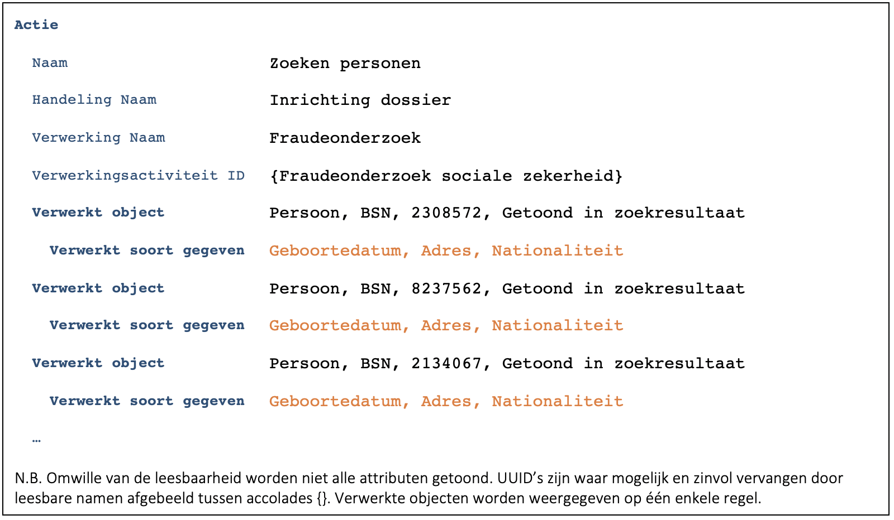

Aangezien besloten is de zoekcriteria niet vast te leggen ([B0233](./0233.md)), levert dit geen bijzonderheden op in de logging.

Het niet vastleggen van de opgehaalde/getoonde velden kan op twee manieren opgelost worden:
1.	Stel de zoekopdracht gaat over personen en de medewerker kan bepalen welke persoonsgegevens getoond worden. In dat geval dient bij het loggen verwezen te worden naar een verwerkingsactiviteit waarbij aangegeven is dat alle persoonsgegevens verwerkt (kunnen) worden.
2.	Bij het loggen wordt aangegeven welke gegevens opgehaald/getoond zijn.

Vanuit transparantie richting de burger heeft oplossing 2 uiteraard de voorkeur.

Hierbij een voorbeeld van een actie waarbij naast de personen ook de getoonde gegevens gelogd worden:

Bij zoekvragen leidt het bij de personen vermelden van de Verwerkte soorten gegevens helaas tot redundantie. Voor diverse andere cases is het echter nodig om per persoon te weten welke gegevens verwerkt zijn. We hadden speciaal voor dit soort cases een apart construct direct onder de actie kunnen maken. We hebben echter voor gekozen om dit om wille van de eenvoud niet te doen en dus de getoonde redundantie te accepteren. Zie ook [B4555](./4555.md) over de modellering van [Verwerkt soort gegeven](../../../gegevenswoordenboek/objecttypen/Verwerkt_soort_gegeven.md).

Indien er in deze casus sprake was geweest van de aanroep van een dienst van een provider dan hadden zowel de consumer als de provider moeten loggen ([B7259](./7259.md)) zoals beschreven in [C9522](./9522.md) en [C2866](./2866.md).

