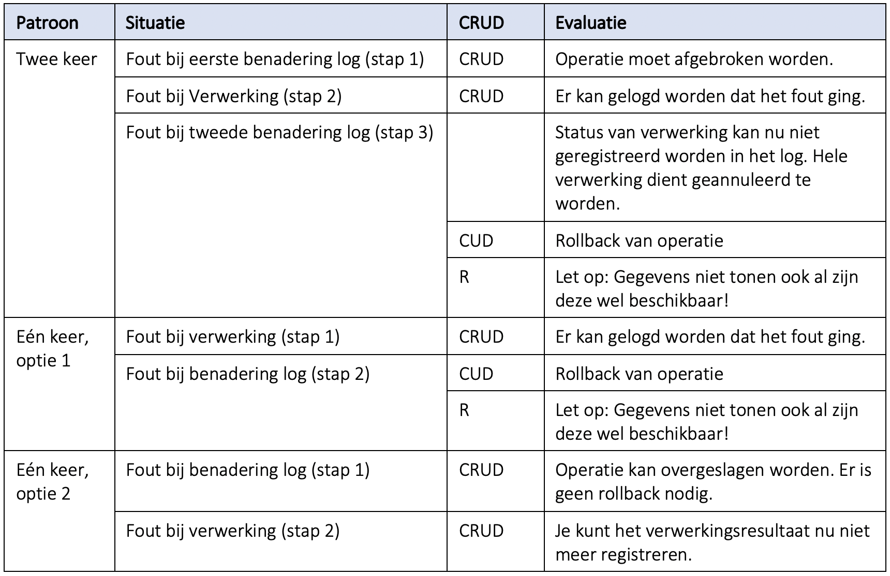
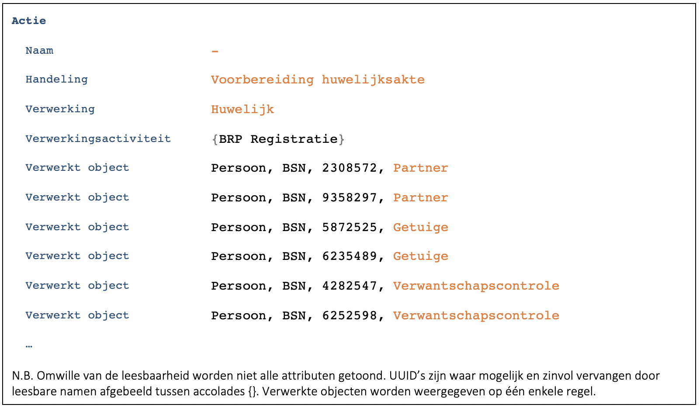
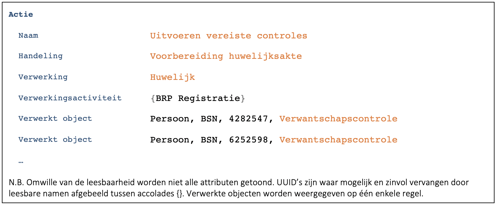
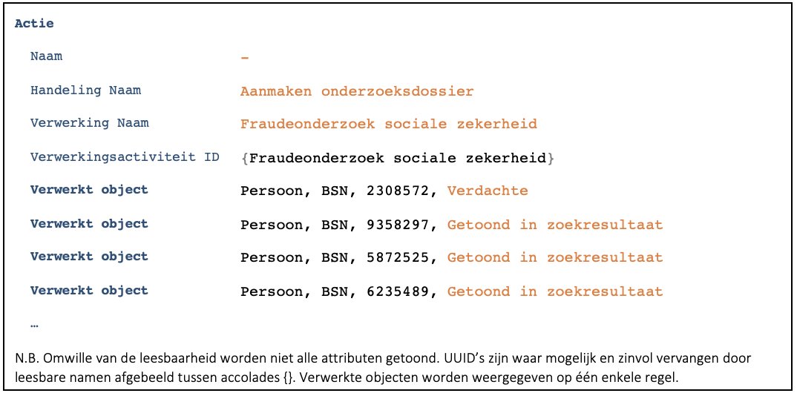
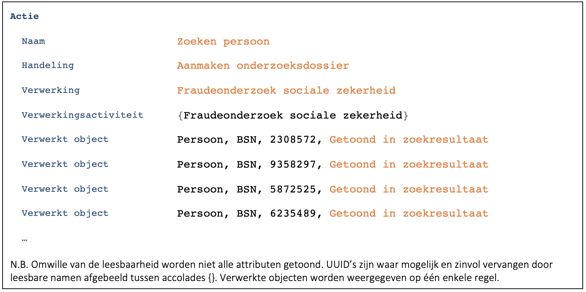
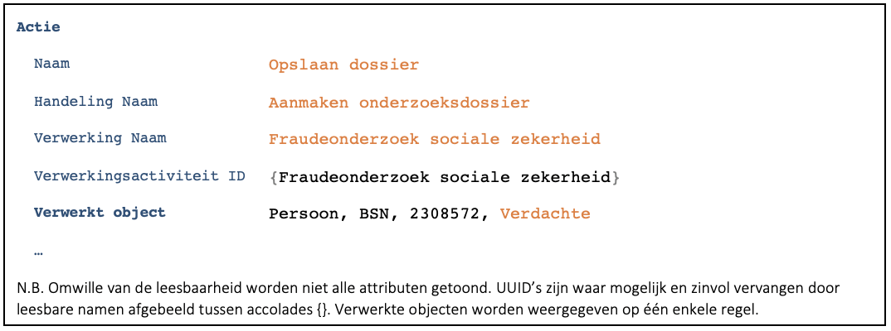

## Besluit
### Welk moment
-	Als de betrokken personen voor het uitvoeren van een actie al bekend zijn, dan moet gelogd worden voordat de actie uitgevoerd wordt. Lukt het loggen niet, dan mag de actie niet uitgevoerd worden. Dit is bijvoorbeeld het geval bij het opvragen of wijzigen van gegevens van een persoon.
-	Zijn de betrokken personen voor het uitvoeren van een actie nog niet bekend, dan kan het niet anders dan dat eerst de actie wordt uitgevoerd en er daarna wordt gelogd. Dit is bijvoorbeeld het geval bij een zoekopdracht op achternaam, postcode en huisnummer. Als na het uitvoeren van de actie het loggen niet lukt, dan mogen de opgehaalde gegevens niet getoond worden.

### Hoe vaak loggen?
-	Bij iedere stap in een proces waarbij er persoonsgegevens betrokken zijn.
-	Stel in een proces worden de volgende stappen uitgevoerd:
    1.	Zoeken van persoon.
    2.	Opvragen van gegevens over de persoon.
    3.	Opslaan van gewijzigde gegevens over de persoon.
- Dan leidt voor elke stap tot een aparte verwerking. De actie van de eerste verwerking is ‘Zoeken persoon’, de actie voor de tweede is ‘Opvragen persoonsgegevens’ en voor de derde ‘Wijzigen persoonsgegevens’.
-	Het kan zijn dat het opvragen of opslaan uit meerdere stappen bestaat omdat er bijvoorbeeld meerdere API-calls of queries nodig zijn. In dat geval hoeft er niet per stap gelogd te worden.

## Toelichting
### Welk moment
Er zijn diverse patronen denkbaar:

**Patroon 1: twee keer benaderen**
1. Benader verwerkingenlog en kondig verwerking aan
2. Voer verwerking uit
3. Benader verwerkingenlog en meld resultaat van verwerking

**Patroon 2: één keer benaderen – Optie 1**
1. Voer verwerking uit
2. Benader verwerkingenlog en registreer verwerking

**Patroon 3: één keer benaderen – Optie 2**
1. Benader verwerkingenlog en registreer verwerking
2. Voer verwerking uit

Merk op dat patroon 1 en 3 niet werken voor situaties, zoals zoeken, waarin nog niet bekend is op welke personen een verwerking betrekking heeft.

In de tabel hieronder zijn voor ieder patroon de mogelijke foutsituaties geanalyseerd.

Op basis van bovenstaande analyse zijn er drie mogelijkheden:
-	Het log twee keer benaderen
    -	Het verwerkingenlog dient nu te ondersteunen dat het verwerkingsresultaat pas in de tweede call geregistreerd wordt. In de tweede call wordt terugverwezen naar de eerste. Dit lijkt atypisch gedrag voor een verwerkingenlog en kan technisch dus complicaties geven (1).
    -	Het moet mogelijk zijn de verwerking ongedaan te maken. In traditionele systemen kan dit met een eenvoudige transactie en een rollback. In architecturen die gericht zijn op api’s tussen de verschillende componenten zal de api moeten kunnen voorzien in de ‘rollback’ (2).
-	Het verwerkingenlog één keer benaderen: eerst verwerken, dan loggen
    -	Ook hier moet het mogelijk zijn om de verwerking ongedaan te maken.
-	Het verwerkingenlog één keer benaderen: eerst loggen, dan verwerken
    -	Dit zou het meest eenvoudige scenario zijn: eenvoudig loggen en geen rollback functionaliteit nodig.

(1) Veel implementaties voor logging zijn geoptimaliseerd om verwerkingenlogentries zo efficiënt mogelijk weg te schrijven. Het ‘even snel opzoeken van een entry’ en deze aanpassen past niet goed in dat patroon. Gevolg is mogelijk dat standaardoplossingen niet bruikbaar zijn en er complexer maatwerk nodig is dat logentries bijvoorbeeld in een buffer bewaart tot bevestiging binnen is of een bepaalde tijd verstreken is.

(2) Bij eenvoudige acties (CRUD) is een rollback wel realiseerbaar. Bij bedrijfsfuncties betreft het vaak veel meer dan alleen het terugdraaien van de gegevens. Een rollback is dan eigenlijk alleen mogelijk wanneer de actie binnen een totaal geïsoleerde transactie is uitgevoerd. Alleen dan weten we zeker dat er niet al allerlei vervolgstappen in gang zijn gezet. Als een systeem het terugdraaien van een actie ondersteunt, is dat vaak omdat er een inverse operatie geïmplementeerd is. Is er meestal geen sprake van ‘gewoon’ terugdraaien. Het uitvoeren van een dergelijke inverse functie zou in de termen van de AVG een nieuwe verwerking zijn. 

In het initiële ontwerp voor verwerkingenlogging werd in het verwerkingenlog vastgelegd of de actie geslaagd was of niet. Op basis van bovenstaande analyse is dit gegeven geschrapt.

### Hoe vaak loggen?
In de eerste – meest eenvoudige – case ([C9172](./9172.md)) hebben we twee momenten waarop het systeem iets met persoonsgegevens doet. Eerst worden de gegevens opgehaald, daarna worden ze gewijzigd opgeslagen. De verwerking uit het eerste deel van dit vraagstuk bestaat nu dus eigenlijk uit twee aparte stappen. De vraag die hierdoor ontstaat is: loggen we beide acties apart of zien we het als één actie?

Er zitten twee aspecten aan dit vraagstuk:
1. Wat betekent de keuze voor de burger
2. Wat betekent de keuze voor de techniek

Bij eenvoudiger handelingen is het loggen van alle aparte stappen wat overdreven. Het zijn juiste de complexere handelingen waarbij het, voor de duidelijkheid, nodig blijkt te zijn. Als voorbeeld wederom de logging van het voorbereiden van een huwelijk.

Eerst zonder dat de tussenstappen gelogd worden:

Nu met logging van een deel van de uitgevoerde stappen.

Door de verschillende stappen (acties) te loggen wordt het verwerkingenlog duidelijker.

Een ander voorbeeld is het uitvoeren van een vertrouwelijk onderzoek. Eerst weer het verwerkingenlog zonder logging van de verschillende stappen.

Daarna het verwerkingenlog waarin de verschillende stappen wel gelogd worden.

Ook nu leidt het loggen van de verschillende stappen tot een duidelijker verwerkingenlog.

N.B. Deze separate registratie van deze acties is ook vanuit privacy by design beter. De eerste actie geeft immers niet aan wie de verdachte is. Mocht er ooit iets fout gaan met filtering van andere personen dan blijft de identiteit van de verdachte beter beschermd.

Zoals in het eerste deel van dit vraagstuk beschreven is, is het lastig genoeg om een actie ongedaan te maken. Als we de hele verwerking ongedaan moeten maken, wordt de techniek nog een stapje lastiger. We moeten dan onthouden welke acties we allemaal hebben uitgevoerd en deze in omgekeerde volgorde ongedaan maken.
