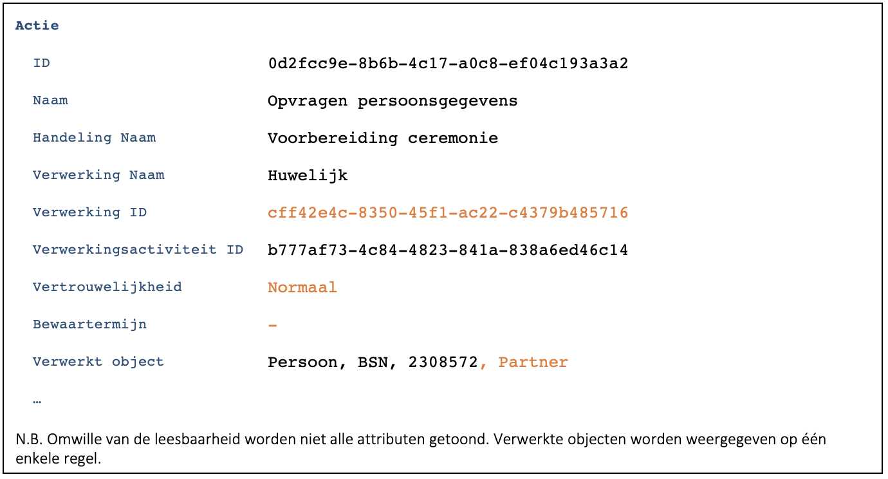
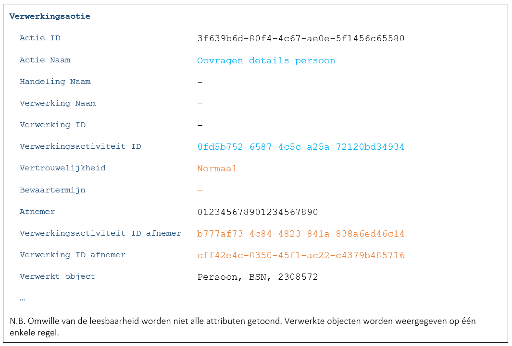

## Situatie
Het is noodzakelijk om alle actie die gelogd zijn n.a.v. een verwerking terug te kunnen vinden. Redenen zijn aanpassing van bewaartermijn of vertrouwelijkheid en het logisch kunnen verwijderen van de logging van een verwerking.

## Besluit
-	Bij het loggen van acties n.a.v. een verwerking moet het UUID van de verwerking meegegeven  worden. Dit UUID wordt opgeslagen in [Verwerking ID](../../../gegevenswoordenboek/attributen/Verwerking.ID.md).
-	Bij het aanroepen van API’s n.a.v. een verwerking moet het UUID van de verwerking meegegeven  worden. Dit UUID wordt door de provider van de API gelogd in [Verwerking afnemer](../../../gegevenswoordenboek/attributen/Verwerking_afnemer.md).
-	Bij het werken met verzoeken en zaken zal de verwerking vaak gelijk zijn aan het verzoek of de zaak. Indien het verzoek of de zaak geïdentificeerd wordt met een UUID, dan kan dit UUID gebruikt worden als [Verwerking ID](../../../gegevenswoordenboek/attributen/Verwerking.ID.md).
-	Het Verwerking ID moet een UUID zijn om te voorkomen dat verschillende applicaties of organisaties dezelfde ID gebruiken.

## Toelichting
Voorbeeld actie zoals gelogd door de consumer:

Voorbeeld actie zoals gelogd door de provider:

De consumer is bezig met het voorbereiden van een huwelijksceremonie. In het kader van deze verwerking worden persoonsgegevens opgevraagd bij de provider. Bij de provider resulteert de aanroep van de API in een eigen verwerking.

Omdat er sprake is van een generieke autorisatie hebben we geen goede naam voor deze verwerking, noch voor de handeling. De functie uit de API wordt vermeld bij de naam van de actie zelf. De verwerking krijgt een eigen UUID en verwijst naar een andere/eigen verwerkingsactiviteit in het VAR. Hierbij maakt het niet uit of de consumer en provider onderdeel zijn van dezelfde gemeente of niet.

De vertrouwelijkheid en bewaartermijn worden door de provider overgenomen van de verwerking van de consumer. De identiteit van de consumer wordt opgeslagen in [Afnemer](../../../gegevenswoordenboek/attributen/Afnemer.md) en het ID van de verwerking van de consumer in [Verwerking afnemer](../../../gegevenswoordenboek/attributen/Verwerking_afnemer.md). Op die manier kan de consumer later een verzoek doen bij de provider om voor verwerking cff42e4c-8350-45f1-ac22-c4379b485716 de bewaartermijn in te stellen op bijvoorbeeld 150 jaar. De provider kan deze verwerking dan terugvinden door te zoeken op het veld [Verwerking afnemer](../../../gegevenswoordenboek/attributen/Verwerking_afnemer.md).
