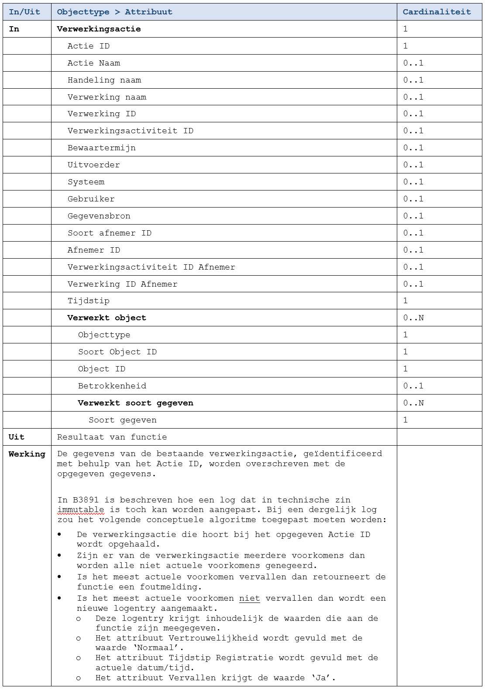

De functie wijzigt een bestaande [verwerkingsactie](../../../gegevenswoordenboek/objecttypen/Verwerkingsactie.md) in het log.

Alle informatie over de verwerkingsactie moet opnieuw meegegeven worden, ook de informatie die niet wijzigt.

