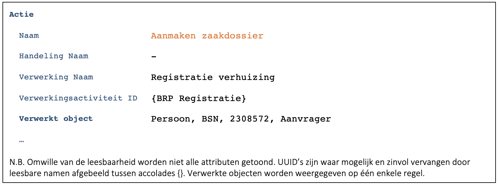
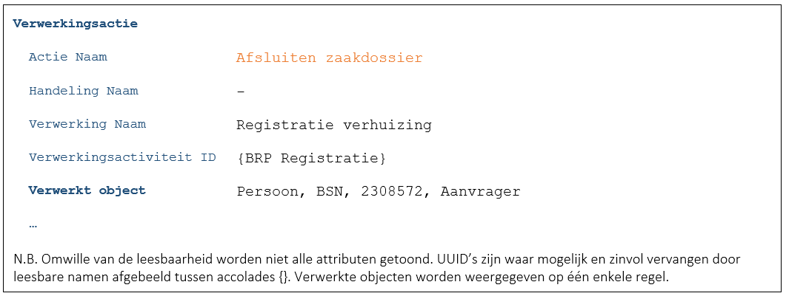

## Algemeen
Deze case is een variant op [C9172](./9172.md). Alleen de verschillen worden beschreven.
De stappen zijn identiek. Verschil is dat er nu gewerkt wordt met een zaakgericht systeem. 

## Scherm Zaakregistratie verhuizing
### Het systeem maakt een zaak voor de Registratie Verhuizing
- Aanname: Alle handelingen worden via zaken afgehandeld, ook de minder complexe zaken zoals registratie verhuizing. Voor zaak kan ook Verzoek gelezen worden. De procedure daarvoor is identiek.
- De zaak is direct gekoppeld aan de persoon en moet dus gezien worden als een persoonsgegeven. De actie voor het aanmaken van de zaak wordt daarom gelogd (F7446):

### Medewerker voert BSN van de burger in
- Identiek aan basis case.

### Applicatie haalt ‘NAW gegevens’ van de burger op en toont deze
- Identiek aan basis case.

### Persoonsgegevens worden aangepast en opgeslagen
- Identiek aan basis case.

### Afsluiten zaak
- Bij afsluiting van de zaak wordt het volgende gelogd (F7446):
    

## Foutscenario’s
Als na het aanmaken van het zaakdossier bij één van de stappen in de verwerking de logging of de actie zelf faalt kan de verwerking onderbroken worden en op een later moment afgerond worden.
