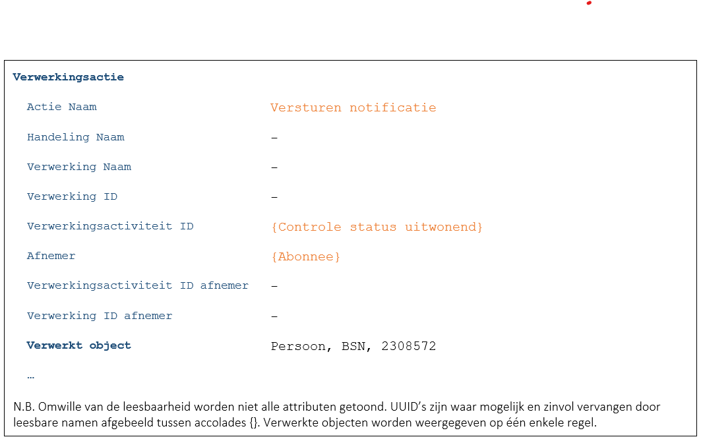

## Situatie
De gemeente heeft de gegevens van een persoon gewijzigd. Een notificatie-service van de gemeente wil de geabonneerde partijen een notificatie sturen om hen te informeren over deze wijziging. De te versturen notificatie bevat zo min mogelijk informatie (informatiearm). Een voorbeeld notificatie:

`Handeling Registratie Verhuizing heeft plaatsgevonden bij burger 2308572.`

N.B. Hierin zou eigenlijk ook nog met pseudonimisering van het BSN gewerkt moeten worden.

Indien nodig kan de ontvangende partij n.a.v. de notificatie extra informatie ophalen via detailvragen. Met behulp van die informatie kan de notificatie dan verwerkt worden.

De notificatie-service zal het versturen van de notificatie moeten loggen. Er worden immers persoonsgegevens verwerkt (BSN en de handeling). Hierna wordt de meest en de minst ideale situatie beschreven.

## Meest ideale situatie
In de meest ideale situatie zou ieder abonnement op de notificatie-service wordt gekoppeld aan één specifieke verwerkingsactiviteit. De notificatie-service ‘weet’ dus als het ware exact waarvoor de gegevens gebruikt gaan worden. Bijvoorbeeld om te controleren of een student nog steeds uitwonend is. De verwerkingenlogging wordt daardoor zo concreet mogelijk ([F7446](./7446.md)):

De gelogde informatie is beperkt maar wel redelijk concreet. In de praktijk is een dergelijke inrichting van de autorisaties en/of het VAR meestal niet te realiseren. 

## Minst ideale situatie
De notificatie-service heeft geen enkele informatie over het gebruik van de notificatie door de afnemer. Mogelijk is ook de afnemer onbekend omdat de service alleen op de hoogte is van de technische end points waar de notificaties naar toegezonden moeten worden.
Als gevolg hiervan is de verwerkingenlogging minimaal ([F7446](./7446.md)):

Vanuit het perspectief van de burger levert een eventuele vervolgvraag vanuit de afnemer hopelijk meer informatie op over het gebruik van de gegevens.
