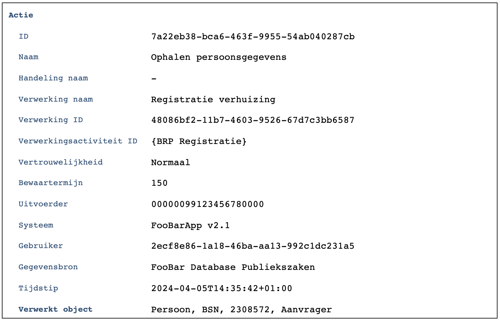
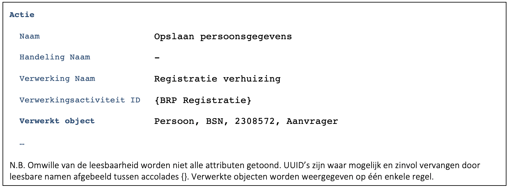

## C9172 - Registratie Verhuizing – Eenvoudig, traditioneel systeem
Deze case beschrijft de binnengemeentelijke verhuizing van een persoon. De beschrijjving is functioneel zo eenvoudig mogelijk. De burger komt aan de balie en er is  geen sprake van meeverhuizende gezinsleden.

### 1. Inloggen gemeentelijke medewerker in het verhuissysteem
-	We loggen geen technische events over inloggen, autorisatie, foutmeldingen etc ([B0538](./0538.md))
### 2. Scherm ‘Registratie verhuizing’
-	Medewerker voert BSN van de burger in
    - Merk op dat de medewerker hierbij gegevens van de burger ziet op het identiteitsbewijs/legitimatiebewijs. Het is denkbaar dat ook dit soort handelingen gelogd worden via de API. Het loggen hiervan valt echter niet binnen de scope van het project ([B4421](./4421.md)).
- Applicatie haalt ‘NAW gegevens’ van de burger op en toont deze
    - Iedere actie die door een systeem wordt uitgevoerd wordt apart gelogd ([B7952](./7952.md)). 
    - De applicatie logt verwerkingen voordat de gegevens opgehaald worden. Kan het verwerkingenlog niet benaderd worden, dan worden de gegevens niet opgehaald ([B7952](./7952.md)).
    - Met behulp van functie [F7446](./7446.md) wordt het volgende gelogd:
    
    

- Specifieke toelichting:
    - In deze specifieke situatie was in het VAR alleen de weinig specifieke verwerkingsactiviteit ‘BRP Registratie’ beschikbaar. De verwerking wordt daarom nader toegelicht door als verwerking ‘Registratie verhuizing’ op te nemen.
    - Het betreft een verwerking die in één keer kan worden uitgevoerd. De verwerking is daardoor niet verder opgesplitst in meerdere stappen (handelingen). De handeling is daarom in dit geval leeg gelaten.
    - Er is altijd sprake van een actie die door een systeem wordt uitgevoerd. In dit geval is dat ‘Ophalen persoonsgegevens’.
    - Het attribuut Verwerking ID mag ook leeggelaten worden. Het zal in latere cases gebruikt worden om acties bij een specifieke verwerking terug te kunnen vinden zodat bijvoorbeeld de bewaartermijn of de vertrouwelijkheid aangepast kan worden ([B3891](./3891.md)). Het ID moet een UUID zijn ([B8157](./8157.md)) en moet als het meegegeven wordt opgeslagen worden als onderdeel van de verwerking (de verhuizing).
- Algemene toelichting:
    - De toelichting op het gegevensmodel geeft een beschrijving van de begrippen Verwerkingsactiviteit, Verwerking, Handeling, Actie, hun onderlinge relatie en attributen.

    - De volgende ontwerpbesluiten gegeven een toelichting bij de keuzes die gemaakt zijn bij het ontwerp van het achterliggende gegevensmodel:
        - [B2357: Kunstmatige identificatoren](./2357.md)
        - [B6856: Hiërarchie: Verwerkingsactiviteit, Verwerking, Handeling en Actie](./6856.md)
        - [B4047: Terminologie: Actie of Operatie](./4047.md)
        - [A7838: Standaardwaarden voor Actie](./7838.md)
        - [B0601: Terminologie: Handeling of Gebeurtenis](./0601.md)
        - [B8157: Opname van Verwerking ID en Verwerking afnemer](./8157.md)
        - [B3908: Opname van Vertrouwelijkheid](./3908.md)
        - [B9559: Opname van Bewaartermijn](./9559.md)
        - [B0516: Identificatie van organisaties](./0516.md)
        - [B7191: Opname van Uitvoerder](./7191.md)
        - [B0378: Opname van Systeem](./0378.md)
        - [B9207: Opname van Gebruiker](./9207.md)
        - [B3133: Geen opname van Rol van de gebruiker](./3133.md)
        - [B9428: Terminologie: Gebruiker of Medewerker](./9428.md)
        - [B8585: Opname van Gegevensbron](./8585.md)
        - [B2017: Opname van Tijdstip](./2017.md)
        - [B7726: Geen opname van Resultaat verwerking](./7726.md)
        - [B2042: Pseudonimisering BSN](./2042.md)
    - [A5924](./5924.md) beschrijft hoe een actie zo duidelijk mogelijk gemaakt kan worden voor de betrokkenen.
    - Merk op dat de informatie die gelogd wordt bedoeld is om de actie te ‘duiden’ (te beschrijven). Het verwerkingenlog is niet bedoeld om exact te kunnen reconstrueren welke gegevens verwerkt zijn ([B5469](./5469.md)).
    - De applicatie kan het UUID van de verwerkingsactiviteit uit de configuratie/instellingen van het programma halen. Het is niet nodig dat de applicatie voorafgaand aan het loggen telkens het VAR benadert om het UUID van de verwerkingsactiviteit op te halen. Als een verwerkingsactiviteit niet langer gebruikt mag worden (vervalt) dan moet dit dus te leiden tot het aanpassen van de configuratie/instellingen. Het heeft de voorkeur dat dit soort acties niet ‘live’ maar juist zorgvuldig als onderdeel van een verzoek tot aanpassing of release doorgevoerd worden. (Zie ook [B0869](./0869.md) en [B8278](./8278.md)).
    - Bij het loggen van de actie worden alleen sleutelwaarden gelogd en dus geen (gedenormaliseerde) informatie die op basis van deze sleutel waarden achterhaald kan worden in andere systemen ([B3238](./3238.md)).
    - [F7446](./7446.md) (Functie verwerkingenlog: Log Actie) beschrijft de API om de actie te loggen.

- Persoonsgegevens worden aangepast en opgeslagen
    - Er worden om de casus eenvoudig te houden bij de controle van de verhuizing geen bedrijfsregels uitgevoerd die nieuwe persoonsgegevens benaderen.
    - Voorafgaand aan het opslaan van de gegevens wordt het volgende gelogd ([F7446](./7446.md)):
    
    

### Foutscenario’s
- Als het loggen voorafgaand aan het opvragen van de persoonsgegevens bij herhaling niet lukt, moet de verwerking (verhuizing) afgebroken te worden.
- Als het loggen voorafgaand aan het opslaan van de persoonsgegevens bij herhaling niet lukt, moet de verwerking (verhuizing) afgebroken te worden.
