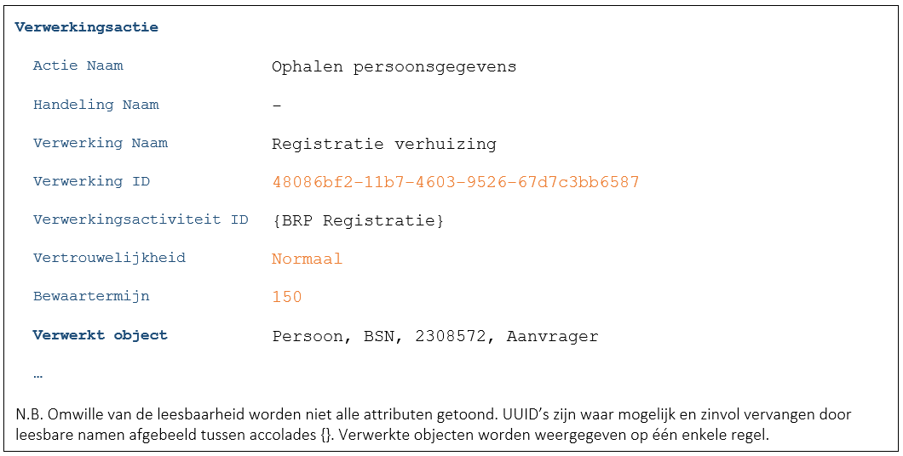
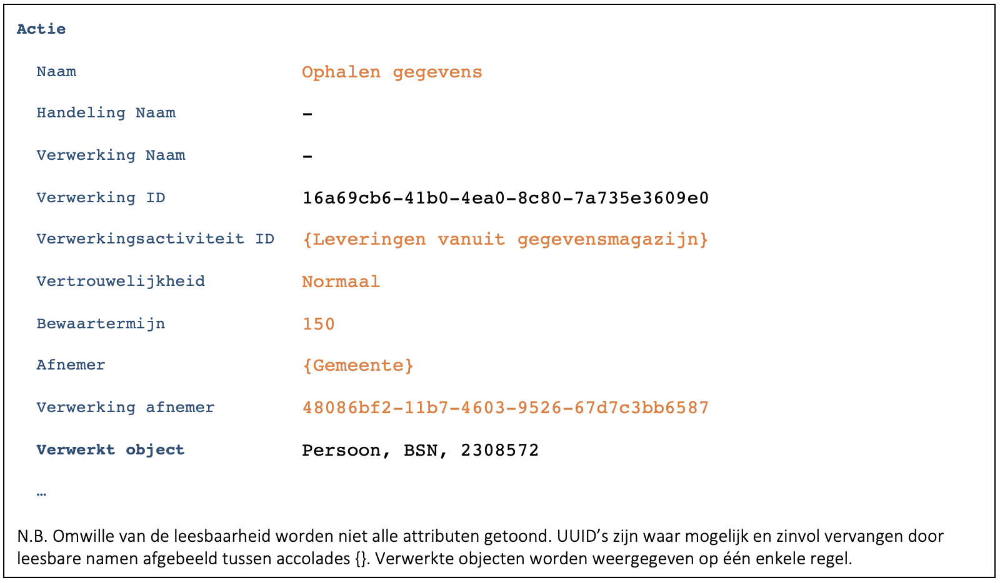

Dit is de meest eenvoudige opvragingscasus. Aanname is namelijk dat we door de aanwezigheid van het zaakdossier weten in welke context de vraag gesteld wordt en deze dus kunnen relateren aan de bijbehorende verwerkingsactiviteit.

De fundamentele ontwerpbesluiten uit de basis bijhoudingscasus ([C9172](./9172.md)) zijn niet opnieuw opgenomen. 

## Zaaksysteem/scherm
### Applicatie toont bepaalde gegevens die nodig zijn voor de afhandeling van de zaak
-	De opvragende applicatie logt (F7446):

-	Toelichting:
    -	Aanname: Het onderwerp van de zaak en de betrokken personen zijn bekend. Op basis van het onderwerp is de bijbehorende verwerkingsactiviteit af te leiden.
    -	De verwerking is feitelijk de zaak of het verzoek. Als de zaak of het verzoek een UUID heeft dan kan deze gebruikt worden. Heeft deze geen UUID dan moet een nieuwe toegewezen worden aan de verwerking.
    -	Mogelijk is ook de handeling bekend. Is deze niet bekend dan zou deze bij voorkeur aan de medewerker gevraagd moeten worden. 
-	De applicatie roept na het loggen de API van de leverende service (provider) aan.
-	De provider logt (F7446):

-	Toelichting:
    - Zie C3472 voor overwegingen of een provider wel of niet dient te loggen.
    - Consumer (applicatie) en provider (service) loggen hun eigen verwerking ([B7259](./7259.md)).
    - Iedere verwerking is gebaseerd op de bijbehorende verwerkingsactiviteit. Dit zijn niet dezelfde verwerkingsactiviteiten.
    - De provider heeft informatie nodig van de consumer om goed te kunnen loggen. Deze informatie wordt bij aanroep van de API in de header meegegeven ([B9177](./9177.md)). Het gaat daarbij om de volgende informatie:
        - OIN van de consumer
        - -	ID van de verwerking
        - -	Vertrouwelijkheid van de verwerking
        - -	Bewaartermijn van de verwerking
    - De provider logt de vertrouwelijkheid en de bewaartermijn.
    - De provider logt de afnemer ([B9330]9./9330.md)). In deze casus is dat de gemeente zelf (binnengemeentelijke levering). 
    - Het ID van de verwerking van de consumer wordt bij de provider overgenomen in Verwerking afnemer.

N.B. De uitwerking van deze casus is identiek aan de bevraging in [C3472](./3472.md).
