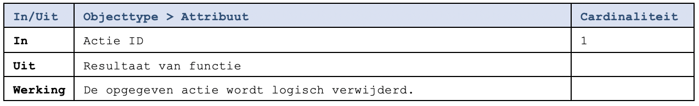

De functie markeert de opgegeven [verwerkingsactie](../../../gegevenswoordenboek/objecttypen/Verwerkingsactie.md) als vervallen. Hierdoor zal deze niet meer geretourneerd worden door de inzage-functies van de verwerkingenlogging API.

