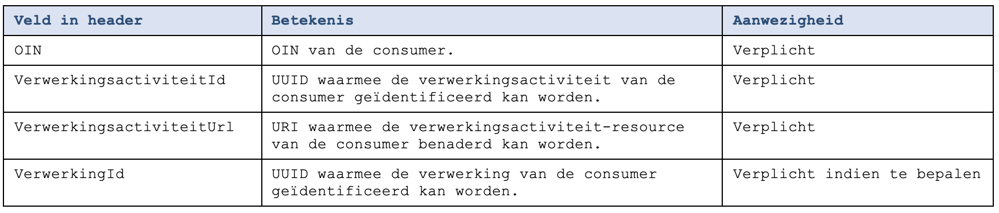
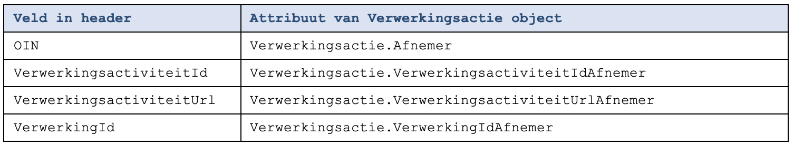

### Autorisatie

| Scope | Autorisatie | 
| :---- | :---- |
| `read:normal` | Laat toe om een beperkte set van attributen van verwerkingsacties te lezen die niet vertrouwelijk zijn of waar de vertrouwelijkheid van is opgeheven. 

### Gedrag

* Er worden alleen verwerkingsacties geretourneerd waarvan het tijdstip valt binnen de opgegeven periode: groter of gelijk aan `beginDatum`, kleiner dan de `eindDatum`.
* Bij het gebruik van de query parameters `objecttype`, `soortObjectId` en `objectId` worden zowel de verwerkingsacties als de verwerkte objecten die in deze verwerkingsacties zijn opgenomen gefilterd. Voorbeeld: we zoeken naar de verwerkingsacties met betrekking tot de persoon met BSN 8273365. Dit is een GET operatie met de volgende query parameters:
  - `objecttype=Persoon`,
  - `soortObjectId=BSN`,
  - `objectId=8273365`. 

Ten eerste worden alleen de verwerkingsacties geretourneerd waarbij het verwerkte object matched met de opgegeven waarden van deze query parameters. Ten tweede worden binnen deze verwerkingsacties de overige verwerkte objecten die niet voldoen aan de de  zoekopdracht niet geretourneerd. Oftewel: Als er bij een verwerkingsactie meerdere personen voorkomen, dan wordt in het kader van de privacy alleen de verwerkte objecten geretourneerd waarbij de gezochte persoon betrokken is.
* Indien de zoekparameter `verwerkingsactiviteitId` is opgegeven, dan worden alleen de verwerkingsacties die voldoen aan die waarde geretourneerd. 
* De volgende elementen worden **niet** geretourneerd: `systeem`, `gebruiker` en `gegevensbron`. 
* Als het log meerdere versies van een verwerkingsactie bevat dan worden alleen actuele niet vervallen versies geretourneerd. Zie [B3891](../achtergronddocumentatie/ontwerp/artefacten/3891.md) voor meer informatie over versies van verwerkingsacties.

## Verplichting opname header 
Als een consumer de GET /verwerkte-objecten aanroept moet deze bij deze aanroep in de header de volgende informatie meegegeven worden ([B9177](../achtergronddocumentatie/ontwerp/artefacten/9177.md)).

De provider van de GET /verwerkte-objecten dient de bevraging van het log te loggen. De provider neemt de informatie uit de header als volgt over:

