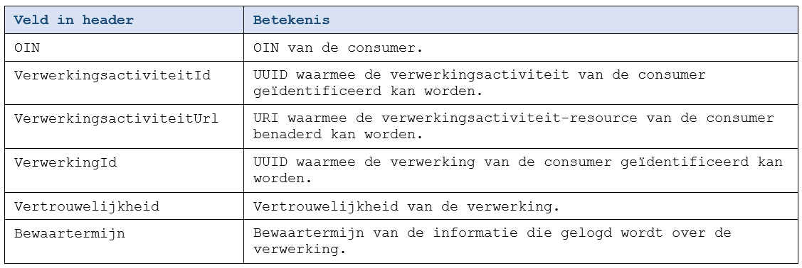
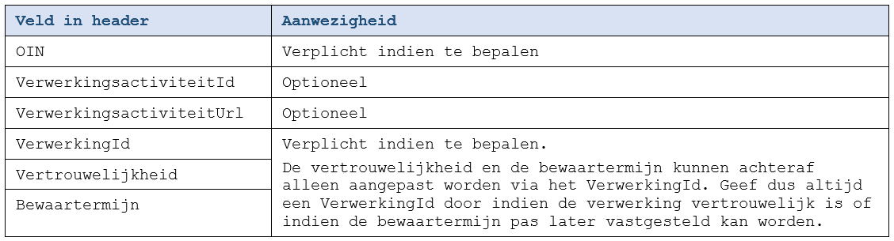

## Over de implementatie van de API-standaard

#### Quick Start Guide

De [Quick Start Guide](../quickstart/index.md) beschrijft beknopt de interactie tussen applicaties, het verwerkingenlog en het verwerkingsactiviteitenregister.

Daarna wordt met behulp van twee voorbeelden beschreven:
* [Minimale logging](https://github.com/VNG-Realisatie/gemma-verwerkingenlogging/blob/master/docs/_content/quickstart/index.md#Minimale-logging-van-verwerkingen) waarbij zowel een consumer als een provider betrokken is.
* [Volledige logging](https://github.com/VNG-Realisatie/gemma-verwerkingenlogging/blob/master/docs/_content/quickstart/index.md#Volledige-logging-van-verwerkingen) die nodig is voor vertrouwelijke verwerkingen, het later vastleggen van bewaartermijnen maar ook voor meer duidelijkheid over de aard van de verwerking richting burgers.

#### Aanpassingen aan consumer applicaties

Uit de [Quick Start Guide](../quickstart/index.md) valt op te maken dat applicaties en services die de verwerkingenlogging API-standaard implementeren op diverse punten moeten worden aangepast.

Uiteindelijk moet voldaan worden aan alle onderstaande punten:

- Bij alle acties die persoonsgegevens verwerken wordt er gelogd ([B7952](../achtergronddocumentatie/ontwerp/artefacten/7952.md)). Hierbij gelden de volgende regels:
    - Alle verwerkingen hebben een eigen ID ([B8157](../achtergronddocumentatie/ontwerp/artefacten/8157.md)).
        - Als de verwerking overeenkomt met een proces uit de bedrijfsvoering (zoals een verzoek of zaak) en dit proces heeft een eigen UUID dan kan dit UUID gebruikt worden.
        - In alle andere gevallen moet een nieuw UUID toegewezen worden.
    - Het ID van de verwerking wordt gelogd en kan later gebruikt worden om acties die over deze verwerking gelogd zijn aan elkaar te relateren, eventuele vertrouwelijkheid te laten vervallen, een bewaartermijn op te geven of de acties in bijzondere situaties aan te passen of logisch te verwijderen.
    - Verwerkingsacties worden zodanig omschreven dat deze duidelijk zijn voor de burger. Hiertoe worden waar mogelijk en zinvol alle attributen van de actie ingezet ([A5924](../achtergronddocumentatie/ontwerp/artefacten/5924.md)).

- Roept de applicatie/service een API aan waarbij die API persoonsgegevens verwerkt? Dan moet bij deze aanroep in de header de volgende informatie meegegeven worden ([B7259](../achtergronddocumentatie/ontwerp/artefacten/7259.md), [B9177](../achtergronddocumentatie/ontwerp/artefacten/9177.md)): `OIN`, `Verwerkingsactiviteit ID`, `Verwerkingsactiviteit URL`, `Verwerking ID`, `Vertrouwelijkheid` en `Bewaartermijn`. Zie ‘*Toevoeging aan de header van alle persoonsgegevens-verwerkende API’s*’ hieronder voor meer informatie.

-  Wordt een service geboden waarbij persoonsgegevens verwerkt worden? Dan moet bij de uitvoering daarvan gekeken worden of in de header van de aanroep de volgende gegevens aanwezig zijn: `OIN`, `Verwerkingsactiviteit ID`, `Verwerkingsactiviteit URL`,` Verwerking ID`, `Vertrouwelijkheid` en `Bewaartermijn`. Deze gegevens dienen overgenomen te worden bij het loggen van de verwerking. Zie ‘*Toevoeging aan de header van alle persoonsgegevens-verwerkende API’s*’ hieronder voor meer informatie.

## Toevoeging aan de header van alle persoonsgegevens-verwerkende APIs
Als een consumer een API aanroept van een provider die persoonsgegevens verwerkt, moet bij deze aanroep in de header de volgende informatie meegegeven worden ([B9177](../achtergronddocumentatie/ontwerp/artefacten/9177.md)).

Aanwezigheid van de header attributen is als volgt:

De provider logt deze informatie als volgt:

## Functionele view

Onderstaande tabel beschrijft de door de API geboden functies. Klik op de naam van de functie voor de beschrijving.

| Categorie \ Functie  |
| :----------- |
| Loggen |
| &nbsp;&nbsp;&nbsp;&nbsp;&nbsp;&nbsp; [F7446: Log Verwerkingsactie](../achtergronddocumentatie/ontwerp/artefacten/7446.md) |
| &nbsp;&nbsp;&nbsp;&nbsp;&nbsp;&nbsp; [F6624: Log Vertrouwelijke Verwerkingsactie](../achtergronddocumentatie/ontwerp/artefacten/6624.md) |
| Opvragen | 
| &nbsp;&nbsp;&nbsp;&nbsp;&nbsp;&nbsp; [F4086: Opvragen Verwerkingsacties – Beperkte set velden, niet vertrouwelijk](../achtergronddocumentatie/ontwerp/artefacten/4086.md) |
| &nbsp;&nbsp;&nbsp;&nbsp;&nbsp;&nbsp; [F2525: Opvragen Verwerkingsacties – Beperkte set velden, vertrouwelijkheid opgeheven](../achtergronddocumentatie/ontwerp/artefacten/2525.md) |
| &nbsp;&nbsp;&nbsp;&nbsp;&nbsp;&nbsp; [F9787: Opvragen Verwerkingsacties – Alle velden, niet vertrouwelijk](../achtergronddocumentatie/ontwerp/artefacten/9787.md)	| 
| &nbsp;&nbsp;&nbsp;&nbsp;&nbsp;&nbsp; [F0143: Opvragen Verwerkingsacties – Alle velden, vertrouwelijk](../achtergronddocumentatie/ontwerp/artefacten/0143.md) | 
| Wijzigen vertrouwelijkheid & bewaartermijn | 
| &nbsp;&nbsp;&nbsp;&nbsp;&nbsp;&nbsp; [F2969: Wijzig vertrouwelijkheid van Verwerking](../achtergronddocumentatie/ontwerp/artefacten/2969.md) |
| &nbsp;&nbsp;&nbsp;&nbsp;&nbsp;&nbsp; [F4415: Wijzig bewaartermijn van Verwerking](../achtergronddocumentatie/ontwerp/artefacten/4415.md) | 
| Bijzondere functies | 
| &nbsp;&nbsp;&nbsp;&nbsp;&nbsp;&nbsp; [F8316: Wijzig Verwerkingsactie](../achtergronddocumentatie/ontwerp/artefacten/8316.md) | 
| &nbsp;&nbsp;&nbsp;&nbsp;&nbsp;&nbsp; [F3835: Wijzig Vertrouwelijke Verwerkingsactie](../achtergronddocumentatie/ontwerp/artefacten/3835.md) |
| &nbsp;&nbsp;&nbsp;&nbsp;&nbsp;&nbsp; [F9906: Verwijder Verwerkingsactie](../achtergronddocumentatie/ontwerp/artefacten/9906.md) | 
| &nbsp;&nbsp;&nbsp;&nbsp;&nbsp;&nbsp; [F2265: Verwijder Vertrouwelijke Verwerkingsactie](../achtergronddocumentatie/ontwerp/artefacten/2265.md) | 

## Technische view

### OAS

API specificatie (OAS3) in
  [ReDoc](http://redocly.github.io/redoc/?url=https://raw.githubusercontent.com/VNG-Realisatie/gemma-verwerkingenlogging/develop/docs/_content/api/oas-specification/logging-verwerkingen-api/openapi.yaml),
  [Swagger](https://petstore.swagger.io/?url=https://raw.githubusercontent.com/VNG-Realisatie/gemma-verwerkingenlogging/develop/docs/_content/api/oas-specification/logging-verwerkingen-api/openapi.yaml) of
  [YAML](https://raw.githubusercontent.com/VNG-Realisatie/gemma-verwerkingenlogging/develop/docs/_content/api/oas-specification/logging-verwerkingen-api/openapi.yaml).

### Aanvullende specificaties

Klik op de API-call in de onderstaande tabel om de aanvullende specificaties te zien.

| Type | API-call |
| :---- | :------- |
| REST | [POST /verwerkingsacties](./aanvullendespecificatie-verwerkingsacties-post.md) |
| REST | [GET /verwerkingsacties](./aanvullendespecificatie-verwerkingsacties-get.md) |
| REST | [PUT /verwerkingsacties/{actieId}](./aanvullendespecificatie-verwerkingsacties-put.md) |
| REST | [DELETE /verwerkingsacties/{actieId}](./aanvullendespecificatie-verwerkingsacties-delete.md) |
| REST | [PATCH /verwerkingsacties](./aanvullendespecificatie-verwerkingsacties-patch.md) |

### Opmerkingen
- De autorisatie-scopes zijn [hier](https://github.com/VNG-Realisatie/gemma-verwerkingenlogging/blob/master/docs/_content/api/oas-specification/logging-verwerkingen-api/scopes.md) beschreven. Als de API call niet voldoet aan de scope dan zal een `HTTP 403 (Forbidden)` foutmelding worden teruggegeven.

## Gehanteerde standaarden
Op de verwerkingenlogging API-standaard zijn de volgende standaarden van toepassing:
- [De REST-API Design Rules (ADR)](https://forumstandaardisatie.nl/open-standaarden/rest-api-design-rules)
- [MIM - Metamodel Informatie Modellering v1.1](https://docs.geostandaarden.nl/mim/mim/)
