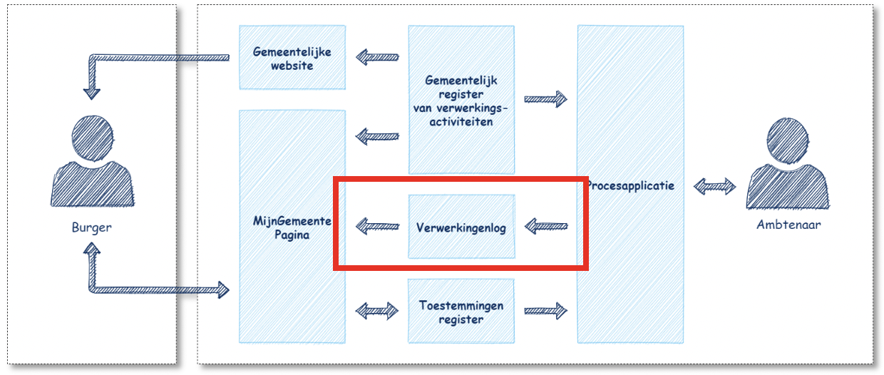

## Algemeen
De Verwerkingenlogging API-standaard standaardiseerd de wijze waarop processystemen de verwerking van (persoons)gegevens kunnen vastleggen in verwerkingenlogs en deze verwerkingenlogs kunnen ontsluiten naar geautoriseerde afnemers. De Verwerkingenlogging API-standaard biedt functies voor:

* aanmaken van verwerkinglogrecords door processystemen;
* bevraging van verwerkinglogrecords door afnemende systemen.

Bij de implementatie van de Verwerkingenlogging API-standaard sprake van een provider (aanbieder) als een consumer (afnemer). De providerrol wordt ingevuld door het verwerkingenlog. Dit informatiesysteem is verantwoordelijk voor de implementatie van de API-functies voor het vastleggen en ontsluiten van verwerkingen van gegevens. Deze component si daarnaast verantwoordelijk voor de opslag van verwerkinglogrecords die door processystemen worden aangeleverd. De consumerrol wordt ingevuld door processystemen die verwerkinglogrecords aanleveren en systemen zoals een MijnGemeente-component die verwerkinglogrecords ontsluiten naar de burger of andere geautoriseerde afnemer. In onderstaande schets is weergegeven welke informatiesystemen in de informatiehuishouding bij de logging van verwerkingen een rol spelen. De positie van de Verwerkingenlogging API-standaard is hierbij in het rood omkaderd aangegeven.

