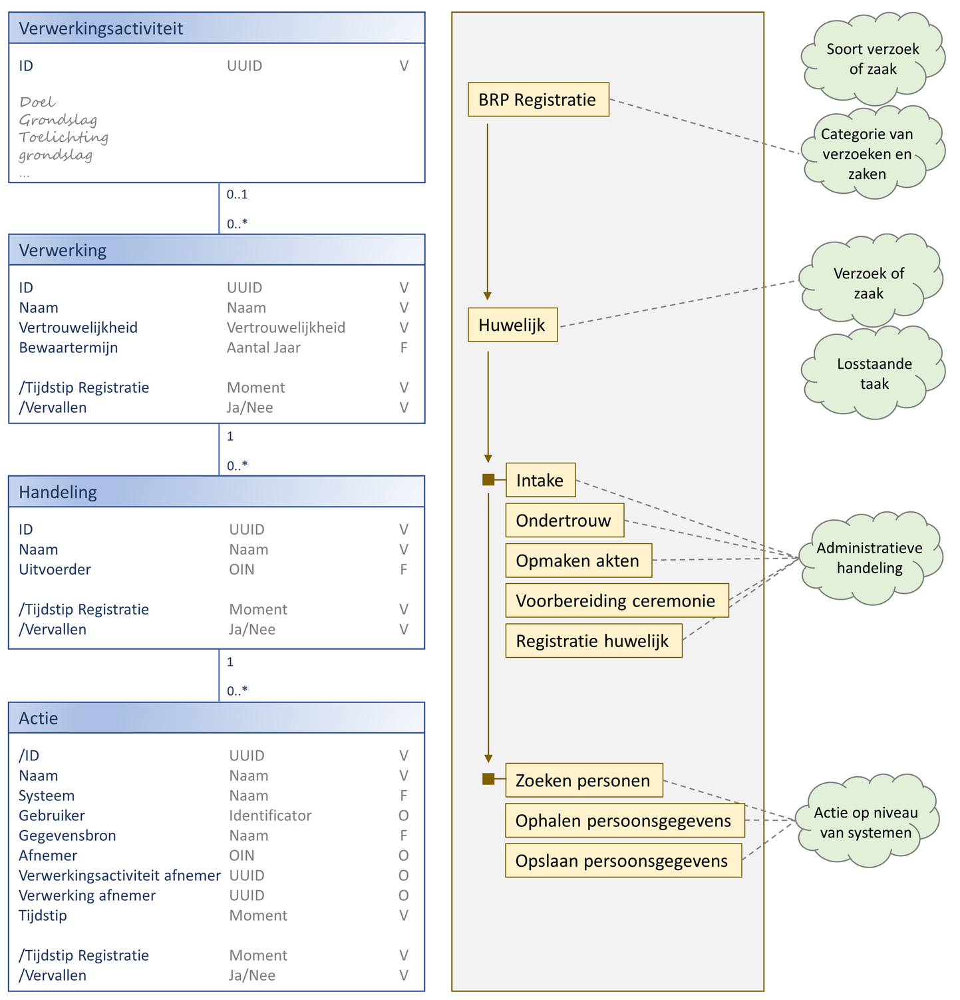
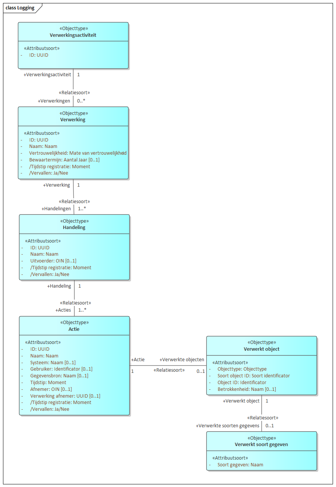
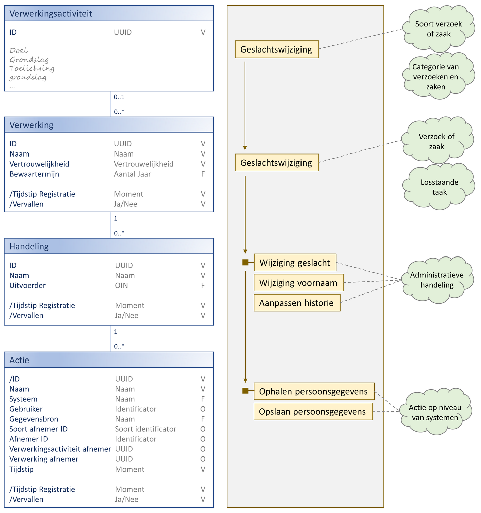
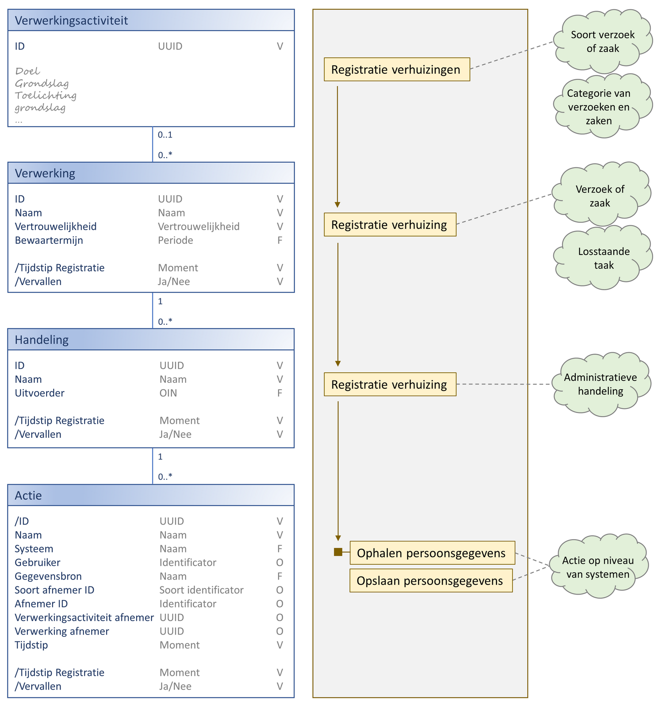
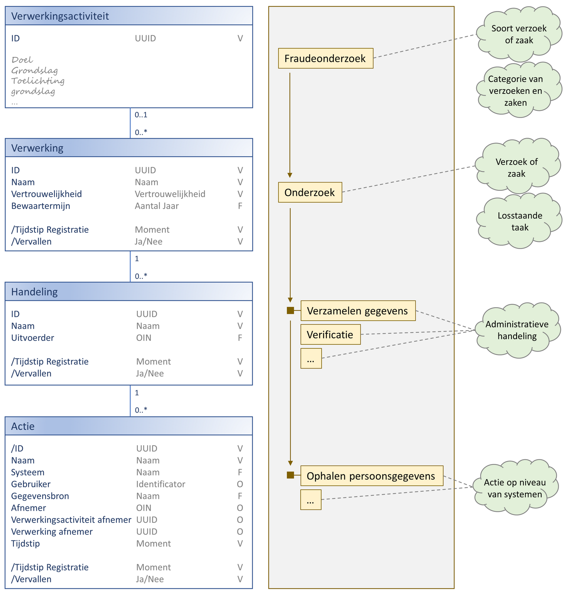
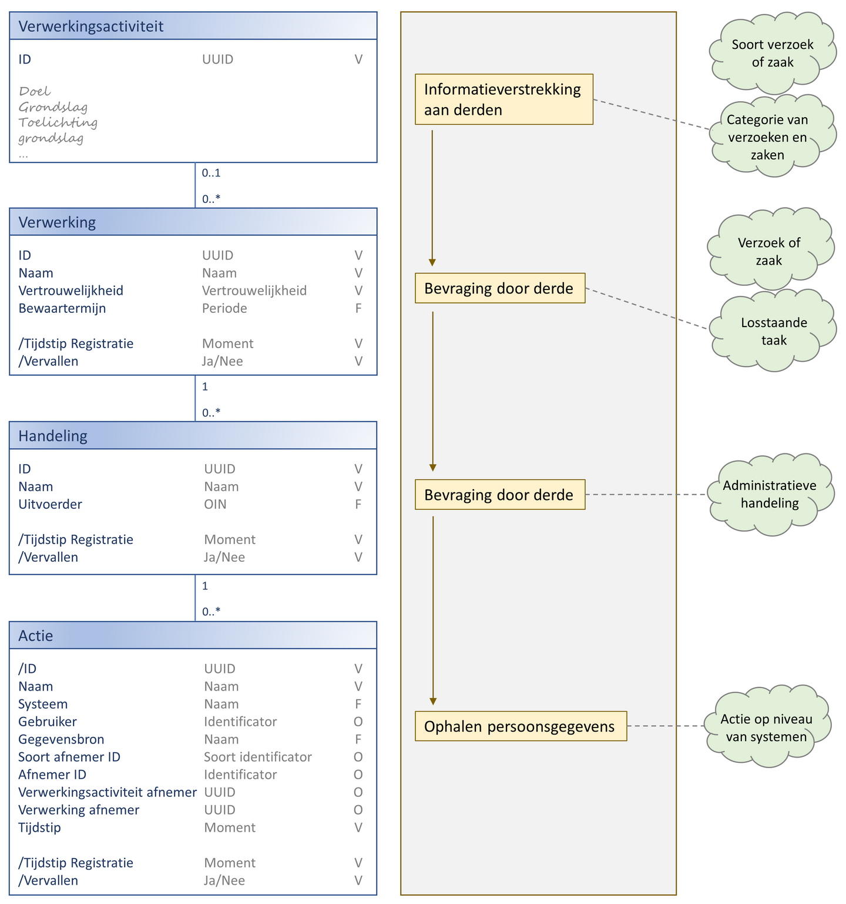

Op basis van de begrippen uit het [gegevensmodel](../index.md) ontstaat het volgende semantische informatiemodel.

-	Aan de linkerkant zien we de verschillende objecttypen die horen bij de geïntroduceerde begrippen. Bij de attributen van de objecttypen zien we drie kolommen. In de eerste kolom staat de naam van het attribuut. In de tweede het type en in de laatste of het attribuut verplicht is. Hierbij worden de volgende waarden gebruikt:
    - `O` = Optioneel
    - `V` = Verplicht
    - `F` = Functioneel verplicht (‘Should have’), maar technisch niet verplicht.
-	In het midden is de eerste casus uit de vorige paragraaf uitgewerkt. We zien dat de verwerking `Huwelijk` bestaat uit een proces waarbij meerdere stappen doorlopen worden. Iedere stap is daarbij een aparte handeling. Voor de eerste handeling in het proces zijn vervolgens de drie bijbehorende de acties uitgewerkt.
-	Aan de rechterkant worden als nadere duiding van de gebruikte begrippen verbindingen gelegd met andere begrippen zoals verzoek en zaak.

De attributen worden op deze plaats niet in detail toegelicht. De belangrijke attributen zijn namelijk terug te vinden in het [uitwisselingsgegevensmodel (UGM)](../uitwisselingsgegevensmodel/readme.md) dat wordt toegelicht in het [gegevenswoordenboek](../../gegevenswoordenboek/readme.md).

Aan het einde van deze pagina zijn, om de verschillende objecttype te duiden, vier aanvullende voorbeelden opgenomen.

## Plaats van attributen (functionele afhankelijkheid)
De plaatsing van de verschillende attributen in het model is lastig te bepalen. Het kan best zijn dat de attributen *Systeem*, *Gebruiker* en *Gegevensbron* bij een bepaalde inrichting van de processen op het niveau van de handeling hadden kunnen zitten. En waarschijnlijk zullen we in de praktijk een casus tegenkomen waarbij bepaalde handelingen of acties een afwijkende bewaartermijn kennen en we deze attributen dus liever lager in de hiërarchie hadden gezien.
De variatie in inrichting van gemeentelijke bedrijfsprocessen en systemen maakt dat de meeste attributen dus eigenlijk op ieder niveau in de hiërarchie zouden moeten kunnen voorkomen. Om de afbeelding overzichtelijk te houden hebben we dit niet gedaan.

## Modellering in Enterprise Architect
Binnen VNG Realisatie wordt Enterprise Architect (EA) gebruikt voor de vastlegging van semantische informatiemodellen (SIM). Onderstaand figuur geeft de modellering van het SIM weer zoals deze in EA is gemodelleerd.

## Aanvullende voorbeelden

### Voorbeeld 'Geslachtswijziging'

### Voorbeeld 'Registratie verhuizing'

### Voorbeeld 'Fraudeonderzoek'

### Voorbeeld 'Informatieverstrekking aan derden'

