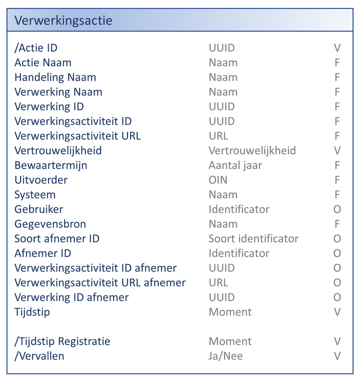
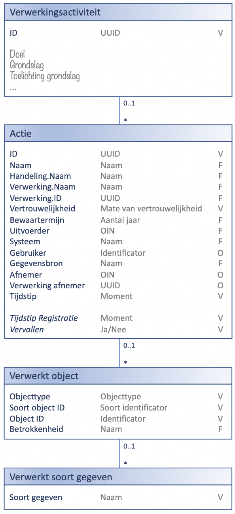
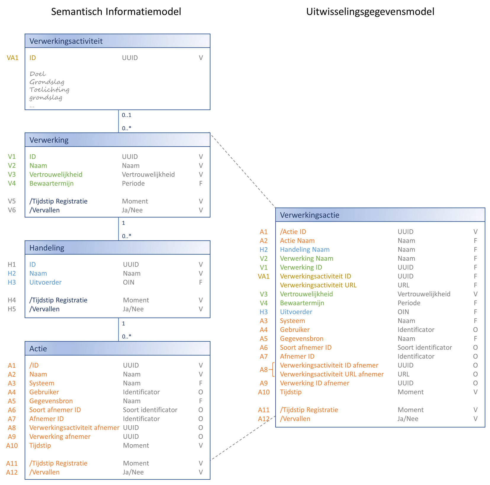
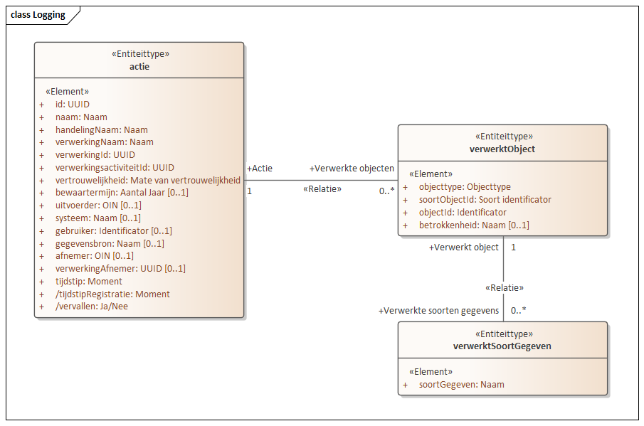

## Kern
Om tot een gegevensmodel voor de uitwisseling te komen kijken we vooral naar het praktische gebruik van het model. We hebben nog een lange weg te gaan voordat logging in alle systemen optimaal geïntegreerd is.

Voor snelle en succesvolle eerste implementaties van de API willen we eenvoud. Tegelijkertijd willen we leveranciers niet tegenhouden om logging direct goed te implementeren. De standaard raakt alle gemeentelijke systemen. Ingrijpende wijzigingen van de standaard zijn daarom bijzonder ongewenst.
We hopen dit te bereiken door de objecttypen Verwerking en Handeling ‘plat te slaan’ in het objecttype Actie. Daardoor ontstaat onderstaande eenvoudigere structuur.

Bij de attributen zien we drie kolommen. In de eerste kolom staat de naam van het attribuut. In de tweede het type en in de laatste of het attribuut verplicht is. Hierbij worden de volgende waarden gebruikt:
- O = Optioneel
- V = Verplicht
- F = Functioneel verplicht (‘Should have’), maar technisch niet.

Bovenstaande structuur is gedenormaliseerd en zal dus leiden tot redundante opslag van informatie. Een voorbeeld: Als de waarde van de Uitvoerder op het niveau van de verwerking vastgelegd had kunnen worden, dan zien we deze waarde nu terug bij iedere actie.

De naamgeving laat nog te wensen over. Idealiter laten we in de naam van het attribuut de naam van het attribuuttype niet terugkomen. Door de denormalisatie is dit niet langer vol te houden. In de namen is nu bewust een ‘.’ gebruikt om te laten zien dat de toevoeging van het type een gevolg is van de denormalisatie.

Voor- en nadelen van deze uitwerking:

|Voordelen|Nadelen|
|--|--|
|Model en API zijn eenvoudiger te begrijpen en daardoor laagdrempeliger in gebruik.|Bij wijziging van een gegeven dat redundant is opgeslagen zullen alle voorkomens aangepast moeten worden.|
|Zowel bij minimaal als maximaal gebruik van alle mogelijkheden van de API blijven de berichten compact en begrijpelijk.||
|De structuur is goed te vertalen naar efficiënte technische modellen.||
|Opslaan en teruglezen van informatie is eenvoudig.||

## Volledig model
In het volledige model treffen we twee nieuwe objecttypen aan:
-	Verwerkt object: Persoon of object betrokken in de verwerking.
-	Verwerkt soort gegeven: Soort gegeven dat verwerkt is.

  
Details over deze objecttypen en hun attributen zijn te vinden in het gegevenswoordenboek. Voorbeelden worden gegeven bij de beschrijving van het [Logging Maturity Level](../../achtergronddocumentatie/logging_maturity_level.md)

## Relatie tussen SIM en UGM
Onderstaande afbeelding toont de relatie tussen het semantisch informatiemodel (SIM) en het uitwisselingsgegevensmodel (UGM).

Aan de linkerzijde staat het volledige SIM, aan de rechter het UGM. De attributen uit het SIM zijn voorzien van een code, deze code is terug te vinden in het UGM. Naast de attributen voor het formele historiepatroon (V5, V6, H4 en H5) vervalt het ID van de Handeling (H1). Dit zou eenvoudig toegevoegd kunnen worden aan de actie zoals dat ook gedaan is voor de verwerking. Het attribuut had echter in geen van de uitgewerkte cases een toegevoegde waarde en dus is het weggelaten.

## Modellering in Enterprise Architect
Binnen VNG Realisatie wordt Enterprise Architect (EA) gebruikt voor de vastlegging van uitwisselingsgegevensmodellen. Onderstaand figuur geeft de modellering van het SIM weer zoals deze in EA is gemodelleerd.

