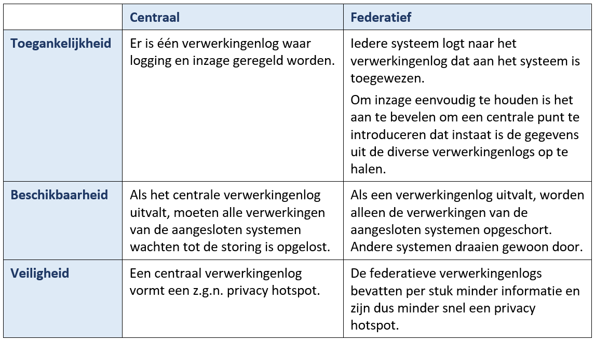

# Deze pagina wordt op dit moment van inhoud voorzien. U wordt vriendelijk verzocht deze pagina op een later moment opnieuw te bezoeken.

# Quick Start Guide - Logging van Verwerkingen

Deze Quick Start Guide is geschreven voor iedereen die te maken krijgt met logging van werkingen: functionarissen gegevensbescherming, privacy officers, informatiearchitecten, ontwikkelaars, beheerders et cetera.

## Inhoudsopgave

[Gemeentelijke voorzieningen](https://github.com/VNG-Realisatie/gemma-verwerkingenlogging/blob/master/docs/_content/quickstart/index.md#Gemeentelijke-voorzieningen)
    Voorbereiden Gemeentelijk Verwerkingsactiviteitenregister (VAR)
    Voorbereiden Gemeentelijk Verwerkingenlog

## Gemeentelijke voorzieningen

Hieronder wordt beknopt beschreven welke zaken een gemeente minimaal moet regelen om in de informatievoorziening te kunnen starten met het loggen van verwerkingen op basis van de door VNG Realisatie gestandaardiseerde Verwerkingenlogging API.

### Voorbereiden Gemeentelijk Verwerkingsactiviteitenregister (VAR)

Aanname is dat de gemeente beschikt over een verwerkingsactiviteitenregister (VAR). In dit register zullen alle verwerkingsactiviteiten voorzien moeten worden van een wereldwijd uniek nummer, een zogenaamde ‘Universal Unique Identifier’ afgekort UUID.

#### Gemeentelijk VAR in de vorm van een document

Indien het gemeentelijk VAR de vorm heeft van een document, zoals een spreadsheet, dan moet daarin een extra kolom opgenomen worden voor dit nummer.
Hieronder is een voorbeeld opgenomen waarin een UUID is toegevoegd aan de verwerkingsactiviteiten in het vooringevulde verwerkingsactiviteitenregister van de IBD:

Er bestaan diverse websites die deze nummers kunnen genereren. Deze zijn te vinden door op het internet te zoeken op ‘Generate UUID’.
Een handige site is bijvoorbeeld [UUIDGenerator.net](https://www.uuidgenerator.net/). Deze site kan meerdere UUID’s genereren en opslaan in een bestand.
N.B. De site gaf aan maximaal vijf nummers te kunnen genereren. Op het moment van schrijven was het echter ook mogelijk om een groter getal (50, 200) in te voeren.

#### Gemeentelijk VAR in de vorm van een informatiesysteem

Is het gemeentelijk VAR een informatiesysteem dan zou het kunnen zijn dat de verwerkingsactiviteiten al te identificeren zijn via een UUID. Is dit nog niet het geval dan zal de ontwikkelaar van het systeem deze toe moeten voegen.

### Voorbereiden Gemeentelijk Verwerkingenlog

Op hoofdlijnen heeft de gemeenten twee keuzen bij de inrichting van het gemeentelijke verwerkingenlog:

1.	Eén centraal verwerkingenlog waarin alle informatiesystemen hun verwerkingen loggen:

2.	Meerdere verwerkingenlogs. Een zogenaamd federatief verwerkingenlog:

Een beknopt overzicht van de kenmerken van de twee varianten:

Zie de [architectuurdocumentatie](../architectuur/index.md) voor meer informatie over de verschillende architecturen.

Het wordt aanbevolen om:
* Een bewuste keuze te maken voor een centraal of federatief verwerkingenlog.
* Een bewuste keuze te maken voor één of meerdere leveranciers. Merk op dat er ook bij een federatief verwerkingenlog sprake kan zijn van één leverancier.
* Een verwerkingenlog te kiezen/realiseren dat de Logging API volledig ondersteunt.
* Overleg te hebben met leveranciers hoe gemeente en leveranciers samen de transitie maken van de huidige situatie naar de gewenste. Zie in dit kader ook de gedachten rond de [Logging Maturity Levels](../achtergronddocumentatie/logging_maturity_level.md).
* In toekomstige aanbestedingen eisen en wensen op te nemen inzake logging van verwerkingen.

Zonder een bewuste keuze en een transitieplan ontstaat er waarschijnlijk vanzelf een situatie waarin er binnen de gemeente meerdere verschillende soorten verwerkingenlogs aanwezig zullen zijn. Leveranciers die dat kunnen, gebruiken dan hun eigen verwerkingenlog om te zorgen dat hun applicaties kunnen functioneren. De gemeente heeft in dat geval mogelijk geen eisen kunnen stellen aan de manier waarop deze applicaties loggen en/of de werking en inrichting van het impliciet geleverde verwerkingslog.

## Implementatie van de Logging API

Hieronder wordt beknopt beschreven wat geregeld moet worden om de Logging API te implementeren. Eerst wordt de meest minimale vorm van logging beschreven, vervolgens de meest volledige vorm.
Bij de meest minimale manier van logging ontstaat een verwerkingenlog met bijzonder weinig informatie. De inhoud hiervan zal veel vragen oproepen bij burgers maar ook bij gemeentelijke medewerkers en ontwikkelaars. Het is dan ook de vraag of het verwerkingenlog in deze meest minimale vorm voldoet aan de geest van de AVG.
De minimale manier van loggen is niet geschikt voor het loggen van vertrouwelijke verwerkingen of voor verwerkingen waarbij op voorhand de bewaartermijn niet vastgesteld kan worden. Zie voor dit soort verwerkingen de meest volledige vorm en de toelichting daarbij.
Vanuit het principe ‘beter iets dan niets loggen’ is besloten om de minimale vorm toch aan te bieden.

Minimale logging van verwerkingen

Minimale logging vanuit een initiërend proces (bijv. een gebruikersapplicatie)

Een initiërend proces is vaak een gebruikersapplicatie waarin een gebruiker een bepaalde verwerking initieert. Ook systemen kunnen verwerkingen initiëren; bijvoorbeeld op basis van vooraf ingestelde triggers.

Het systeem logt de verwerking door met behulp van de Logging API een verwerkingsactie aan te maken. <OAS specificatie, kunnen we doorlinken naar de Post? >
Hierbij logt het systeem de volgende informatie:

Verwerkingsactie	
     Verwerkingsactiviteit ID	UUID van de verwerkingsactiviteit uit het verwerkingsactiviteitenregister.
Voorbeeld: 5f0bef4c-f66f-4311-84a5-19e8bf359eaf
     Vertrouwelijkheid	Vertrouwelijkheid van de verwerking.
Voorbeeld: Normaal
     Bewaartermijn	Bewaartermijn van de verwerkingsactie in jaren.
Voorbeeld: 150
     Uitvoerder	Overheidsidentificatienummer van de uitvoerder.
Alleen in te vullen indien de gemeente niet zelf de uitvoerder is.
Voorbeeld: 00000099123456780000
     Systeem	Naam en versie van het systeem dat de verwerking uitvoert. Liefst conform de benaming in de Gemma Softwarecatalogus.
Voorbeeld: FooBarApp v2.1
     Gebruiker	Gebruiker die de verwerking uitvoert. I.v.m. de privacy van de gebruiker mag hier geen informatie opgegeven worden die eenvoudig te herleiden is naar de gebruiker. Iedere gemeente bepaalt zelf of opname van de gebruiker wel of niet gewenst is. Vul dit veld dus alleen in indien de gemeente dit vereist.
Voorbeeld: 2ecf8e86-1a18-46ba-aa13-992c1dc231a5
     Gegevensbron	Naam van de gegevensbron waarin de gegevens die betrokken zijn bij de verwerking worden opgeslagen. 
Voorbeeld: FooBar Database Publiekszaken
     Tijdstip	Tijdstip waarop het systeem/de applicatie de verwerking heeft uitgevoerd.
Voorbeeld: 2024-04-05T14:35:42+01:00
     Verwerkt object	In dit objecttype wordt een betrokken persoon vastgelegd.
           Objecttype	Bij het vastleggen van verwerkingen over personen moet dit veld de waarde ‘Persoon’ hebben.
Waarde: Persoon
          Soort object ID	Bij het vastleggen van publiekrechtelijke verwerkingen over personen heeft dit veld de waarde ‘BSN’. Bij privaatrechtelijke verwerkingen moet de naam van een alternatieve identificator opgegeven worden.
Voorbeeld: BSN
          Object ID	Bevat de waarde van de identificator van de persoon. Als het ‘Soort object ID’ een ‘BSN’ is, wordt in dit veld het BSN ingevuld.
Voorbeeld: 2308572 
     Verwerkt object	Indien er meerdere personen bij de verwerking betrokken zijn volgt hier de identificatie van de volgende persoon.
          ...	

N.B. Er wordt nog uitgezocht hoe we de autorisatie voor de toegang tot de verschillende API functies het beste kunnen inrichten. Het kan zijn dat er aparte functies ontstaan voor normale en voor vertrouwelijke verwerkingen. In die situatie komt het attribuut Vertrouwelijk uit de hiervoor getoonde Verwerkingsactie te vervallen.

Toelichting:
	Systemen mogen er niet vanuit gaan dat een verwerkingsactiviteit voor alle gemeenten dezelfde UUID heeft. Het moet dus mogelijk zijn om het systeem zo te configureren dat, voor bijvoorbeeld de verwerkingsactiviteit Geboorteaangifte, bij gemeente A een ander UUID gelogd wordt dan bij gemeente B.
	Bij minimale verwerkingslogging mag de verwerking niet vertrouwelijk zijn en moet de bewaartermijn bekend zijn. Is dit niet het geval zie dan de uitleg over <Volledige logging van verwerkingen>.
	Technisch gezien zijn maar weinig velden in het bericht verplicht (zie <OAS specificatie>). De velden zijn optioneel gemaakt om te voorkomen dat er niet gelogd wordt op het moment dat bepaalde informatie echt niet voorhanden is. Operationeel gezien moet wel geprobeerd worden zoveel mogelijk informatie te verstrekken. De velden zijn namelijk direct afgeleid uit de vereisten die de AVG stelt en zijn daarmee functioneel gezien niet optioneel.

Een Verwerkingsactie kent drie velden die door het verwerkingenlog bepaald worden:
	Het veld Actie ID wordt gevuld met een nieuw UUID.
	Het veld Tijdstip registratie wordt gevuld met de actuele datum en tijd.
	Het veld Vervallen wordt gevuld met de waarde ‘Nee’.

Aanroepen van een dienst vanuit een initiërend proces

Als bijvoorbeeld een applicatie voor vergunningen (het initiërend proces) persoonsgegevens ophaalt bij een gegevensmagazijn, dan verwerken beide systemen persoonsgegevens en moeten beide systemen loggen. We noemen de applicatie voor de vergunningen de ‘afnemer’ en het gegevensmagazijn de ‘aanbieder’.

In bovenstaande voorbeeld is het goed denkbaar dat de vergunningen applicatie ‘weet’ waarom de verwerking wordt uitgevoerd. Bijvoorbeeld omdat de functie ‘Registratie goedkeuring bouwvergunning’ door de gebruiker uit een keuzemenu in de applicatie geselecteerd is. De afnemer kan (en moet) in een dergelijk geval dus nauwkeurig in het log aangegeven waarom de gegevens verwerkt zijn. Zie voor een voorbeeld van een uitgebreider omschreven Verwerkingsactie de passages over <Volledige logging van verwerking>.

De aanbieder baseert zich bij het leveren van de informatie over het algemeen op een minder specifiek beschreven verwerkingsactiviteit in het VAR. Bijvoorbeeld ‘Verstrekking van gegevens i.v.m. vergunningen’ of nog minder specifiek ‘Verstrekking van gegevens’.

Er is in het voorbeeld dus sprake van twee verwerkingen. Eén bij de afnemer en één bij de aanbieder. Beide verwerkingen baseren zich op een andere verwerkingsactiviteit in het VAR.

Om te zorgen dat de aanbieder toch voldoende informatie op kan nemen in het verwerkingenlog moet de afnemer in de html header van de aanroep de volgende informatie meegeven:

N.B. We laten de inhoud van dit voorbeeld aansluiten bij het vorige voorbeeld.

Html header velden	
     OIN	Voert de gemeente het initiërende proces zelf uit, dan bevat dit veld het OIN van de gemeente. Heeft de gemeente de uitvoering belegd bij een derde dan bevat dit veld het OIN van de uitvoerder.
In het voorbeeld is de uitvoerder een derde partij. Het OIN van die partij is daarom in dit veld opgenomen.
Voorbeeld: 00000099123456780000
     Verwerkingsactiviteit ID	UUID waarmee de verwerkingsactiviteit van de afnemer geïdentificeerd kan worden.
Voorbeeld: 5f0bef4c-f66f-4311-84a5-19e8bf359eaf
     Verwerkingsactiviteit Url	URI waarmee de verwerkingsactiviteit-resource van de afnemer benaderd kan worden.
Voorbeeld: https://...
     Vertrouwelijkheid	Vertrouwelijkheid van de verwerking.
Voorbeeld: Normaal
     Bewaartermijn	Bewaartermijn van de informatie die gelogd wordt over de verwerking.
Voorbeeld: 150

Toelichting:
	Er is besloten om deze informatie mee te geven in de html header van de berichten en niet in de zogenaamde payload. Daarmee wordt voorkomen dat alle berichtdefinities van alle systemen die persoonsgegevens verwerken aangepast moeten worden. Ook maakt het gefaseerde implementatie van verwerkingslogging mogelijk. Zo kan het voorkomen dat systeem A de informatie al wel meegeeft bij de aanroep van dienst B, maar dat dienst B deze nog niet kan verwerken.
	Technisch gezien zijn de velden optioneel. Operationeel gezien moet geprobeerd worden zoveel mogelijk informatie te verstrekken.
	In dit voorbeeld is sprake van mandatering <zie case C2672> daarbij blijft de gemeente verantwoordelijk. Zie voor delegatie case <C7883>.

Minimale logging vanuit een dienstaanbieder

De aanbieder van de dienst, in ons voorbeeld het gegevensmagazijn, neemt via de API de volgende verwerkingsactie op in het verwerkingslog. De verwerkingsactie bevat diverse velden waarin de informatie uit de html header in terecht is gekomen. Deze velden zijn met een * in de linker kantlijn gemarkeerd.

Verwerkingsactie	
     Verwerkingsactiviteit ID	UUID van de verwerkingsactiviteit uit het verwerkingsactiviteitenregister.
Dit is de verwerkingsactiviteit van de aanbieder. Niet die van de afnemer. In het voorbeeld is dit dus ‘Verstrekking van gegevens’ en niet ‘Registratie toekenning bouwvergunning’.
Voorbeeld: 4f6db294-830d-4d14-b9bd-3c6d17c40d65
*   Vertrouwelijkheid	Vertrouwelijkheid van de verwerking.
Voorbeeld: Normaal
Overgenomen uit de html header die door de afnemer verstrekt is.
*   Bewaartermijn	Bewaartermijn van de verwerkingsactie in jaren.
Voorbeeld: 150
Overgenomen uit de html header die door de afnemer verstrekt is.
     Uitvoerder	Biedt de gemeente de dienst zelf aan, dan bevat dit veld het OIN van de gemeente. Heeft de gemeente de uitvoering belegd bij een derde dan bevat dit veld het OIN van de uitvoerder.
We gaan er in het voorbeeld vanuit dat de gemeente het gegevensmagazijn in eigen beheer heeft en laten dit veld dus leeg.
     Systeem	Naam en versie van het systeem dat de verwerking uitvoert. Liefst conform de benaming in de Gemma Softwarecatalogus.
Voorbeeld: FooBarService v1.3
     Gegevensbron	Naam van de gegevensbron waarin de gegevens die betrokken zijn bij de verwerking worden opgeslagen. 
Voorbeeld: FooBar Gegevensmagazijn
*   Soort afnemer ID	Soort identificator waarmee de afnemer geïdentificeerd wordt.
Voorbeeld: OIN
*   Afnemer ID	Bij levering van gegevens moet hier de identificator opgenomen worden van de organisatie die de gegevens ontvangt. Het attribuut Soort afnemer ID) bepaalt wat voor soort identificator gebruikt wordt om de afnemer te identificeren. Op dit moment kan gekozen worden uit een OIN voor organisaties en een BSN voor natuurlijke personen.
Voorbeeld: 00000099123456780000
Overgenomen uit de html header die door de afnemer verstrekt is.
*   Verwerkingsactiviteit ID
     afnemer	Identificator van de verwerkingsactiviteit aan de kant van de afnemer.
Voorbeeld: 5f0bef4c-f66f-4311-84a5-19e8bf359eaf
Overgenomen uit de html header die door de afnemer verstrekt is.
*   Verwerkingsactiviteit URL
     afnemer	Identificator van de verwerkingsactiviteit aan de kant van de afnemer.
Voorbeeld: https://...
Overgenomen uit de html header die door de afnemer verstrekt is.
     Tijdstip	Tijdstip waarop het systeem/de applicatie de verwerking heeft uitgevoerd.
Voorbeeld: 2024-04-05T14:35:43+01:00
     Verwerkt object	In dit objecttype wordt de betrokken persoon vastgelegd.
           Objecttype	Bij het vastleggen van verwerkingen over personen moet dit veld de waarde ‘Persoon’ hebben.
Waarde: Persoon
          Soort object ID	Bij het vastleggen van publiekrechtelijke verwerkingen over personen heeft dit veld de waarde ‘BSN’. Bij privaatrechtelijke verwerkingen moet de naam van een alternatieve identificator opgegeven worden.
Voorbeeld: BSN
          Object ID	Bevat de waarde van de identificator van de persoon. Als het ‘Soort object ID’ een ‘BSN’ is, wordt in dit veld het BSN ingevuld.
Voorbeeld: 2308572
     Verwerkt object	Indien er meerdere personen bij de verwerking betrokken zijn volgt hier de identificatie van de volgende persoon.
          ...	

Inzage

Voor inzage in het log kan gebruik gemaakt worden van de API-functie Opvragen Verwerkingsacties. Deze functie kent vier varianten:
	Opvragen Verwerkingsacties – Beperkte set velden, niet vertrouwelijk
	Opvragen Verwerkingsacties – Beperkte set velden, vertrouwelijkheid opgeheven
	Opvragen Verwerkingsacties – Alle velden, niet vertrouwelijk
	Opvragen Verwerkingsacties – Alle velden, vertrouwelijkheid opgeheven

N.B. Er wordt nog uitgezocht hoe we de autorisatie voor de toegang tot de verschillende API functies het beste kunnen inrichten. Het kan zijn dat er aparte functies ontstaan (zoals hierboven getoond) voor normale en voor vertrouwelijke verwerkingen. 

Over de verschillende functies:
	Bij de eerste twee varianten worden niet alle velden geretourneerd. Zo wordt om privacy redenen de gebruiker niet geretourneerd en om wille van de veiligheid het systeem en de gegevensopslag niet.
	De laatste twee functies retourneren deze informatie wel. Alleen een bevoegde functionaris zoals bijvoorbeeld een Privacy Officer zou hiervoor geautoriseerd mogen worden. 
	De ‘niet vertrouwelijke’ functies retourneren alleen verwerkingsacties over verwerkingen die niet vertrouwelijk zijn en die dit ook nooit geweest zijn. De ‘vertrouwelijkheid opgeheven’ functies retourneren ook verwerkingsacties die ooit vertrouwelijk geweest zijn. Verwerkingsacties acties die ooit vertrouwelijk waren, moet ook na het opheffen van die vertrouwelijkheid vaak gezien worden als ‘bijzondere persoonsgegevens’. Denk aan een fraudeonderzoek. Zelfs als een dergelijk onderzoek uiteindelijk niets opgeleverd heeft, kan het aantreffen van verwerkingsacties over een onderzoek leiden tot een vooroordeel. Ook deze functies mogen dus alleen door bevoegde functionarissen zoals Privacy Officers gebruikt worden.

Alle inzagefuncties kennen dezelfde zoekparameters:

Zoekparameters	
     Objecttype	Bij het zoeken van verwerkingsacties over personen moet dit veld de waarde ‘Persoon’ hebben.
Waarde: Persoon
     Soort object ID	Bij het zoeken van verwerkingsacties n.a.v. publiekrechtelijke verwerkingen over personen heeft dit veld de waarde ‘BSN’. Bij privaatrechtelijke verwerkingen moet de naam van een alternatieve identificator opgegeven worden.
Voorbeeld: BSN
     Object ID	Bevat de waarde van de identificator van de persoon. Als het ‘Soort object ID’ een ‘BSN’ is, wordt in dit veld het BSN ingevuld.
Voorbeeld: 2308572
     Begindatum	Er wordt gezocht naar verwerkingsacties waarvan het Tijdstip groter of gelijk is aan deze datum.
     Einddatum	Er wordt gezocht naar verwerkingsacties waarvan het Tijdstip kleiner of gelijk is aan deze datum.

Toelichting:
	Alle parameters zijn verplicht. Verwerkingsacties kunnen dus alleen per persoon en per periode opgehaald worden.

Zijn er binnen de gemeente meerdere verwerkingslogs aanwezig, dan dienen deze via één centraal punt bevraagd te kunnen worden. Zie voor meer informatie hierover <verwijzing naar architectuur>.

Volledige logging van verwerkingen

Volledige logging van verwerkingen richt zich op twee aspecten: begrijpelijkheid en aanpasbaarheid.

Begrijpelijkheid

Bij minimale logging kunnen we het doel van de verwerking alleen afleiden uit de verwerkingsactiviteit. Geen van de overige velden geeft aanvullende informatie over het doel van de verwerking:

Verwerkingsactie	
     Verwerkingsactiviteit ID	UUID van de verwerkingsactiviteit uit het verwerkingsactiviteitenregister.
Voorbeeld: 5f0bef4c-f66f-4311-84a5-19e8bf359eaf

Gevolg is dat we afhankelijk zijn van de inrichting van het gemeentelijk VAR. Het VAR kan de verwerkingsactiviteiten gedetailleerd beschrijven (Huwelijk) of juist globaal (BRP Registratie). Een VAR met meer gedetailleerde verwerkingsactiviteiten zoals Huwelijk zal automatisch leiden tot een begrijpelijker verwerkingenlog. Toch is er voor een echt begrijpelijk verwerkingenlog meer nodig.
Bij een verwerking zoals een huwelijk worden er over een langere periode allerlei handelingen verricht. Het voornemen wordt bekend gemaakt, getuigen worden geregistreerd, onderlinge verwantschap wordt gecontroleerd et cetera. Het verwerkingenlog zal een stuk duidelijker worden als we deze verschillende stappen zo duidelijk mogelijk registreren.
Bij alle personen die betrokken zijn in deze stappen verschijnt het huwelijk in hun verwerkingenlog. Ook bij de getuigen en de verwanten! Omdat het bij deze betrokkenen niet over het eigen huwelijk gaat, kan dat bijzonder verwarrend zijn. Het is daarom verstandig om bij de personen op te nemen waarom ze betrokken zijn bij de verwerking: als partner, getuige, betrokken in verwantschapscontrole et cetera.

Om te komen tot een begrijpelijk verwerkingenlog werken we met de volgende begrippen: Verwerking, Handeling en Actie. Om de begrippen duidelijk te maken bevat de onderstaande tabel enkele voorbeelden: 

	Case 1	Case 2	Case 3	Case 4	Case 5
Verwerkings-
Activiteit	BRP Registratie	Geslachtswijziging	Registratie verhuizingen	Fraudeonderzoek sociale zekerheid	Verstrekken van informatie aan derden
Verwerking	Huwelijk	Geslachtswijziging	Registratie verhuizing	Onderzoek	Bevraging door derde
Handeling	- Intake
- Ondertrouw
- Opmaken akten
- Voorbereiding ceremonie
- Registratie huwelijk	- Wijziging geslacht
- Wijziging voornaam
- Aanpassen historie	Registratie verhuizing	- Verzamelen gegevens
- Verificatie
…	Bevraging door derde
Actie	- Zoeken personen
- Ophalen pers. gegevens
- Opslaan pers. gegevens	- Ophalen pers. gegevens
- Opslaan pers. gegevens	- Ophalen pers. gegevens
- Opslaan pers. gegevens	…	Ophalen pers.gegevens

Toelichting:
	Verwerking:
Een verwerking is een concrete taak die een gemeente uitvoert. De taak vormt vanuit het perspectief van de burger of medewerker een logisch geheel.
Vaak correspondeert een verwerking met een verzoek of zaak. Hoort de verwerking bij een globale verwerkingsactiviteit, zoals ‘BRP registratie’, dan geeft de verwerking nadere informatie over het soort verwerking. 
	Handeling:
Een handeling is één stap in de uitvoering van een verwerking. Deze stap kan bij een zogenaamde ‘happy flow’ zonder onderbrekingen uitgevoerd worden.
Bestaat een verwerking maar uit één stap dan kan dit niveau weggelaten worden. De informatie is vooral van belang bij processen of zaken die uit meerdere stappen bestaan die verspreid over een bepaalde periode uitgevoerd worden.
	Actie:
Een actie is een operatie die wordt uitgevoerd door een geautomatiseerd systeem waarbij er (persoons)gegevens verwerkt worden. Een actie wordt uitgevoerd als onderdeel van (een handeling van) een verwerking.
In de praktijk zal het uitvoeren van een handeling al snel leiden tot meerdere verwerkingsactiviteiten in het verwerkingenlog die relatief snel achter elkaar uitgevoerd zijn. De actie kan helpen om te begrijpen waarom het log al deze verschillende verwerkingsactiviteiten bevat.

Om duidelijk te maken waarom iemand betrokken is bij een verwerking wordt het begrip Betrokkenheid als nadere duiding toegevoegd aan de bij de verwerking betrokken personen.

Met al deze extra informatie komt een volledige verwerkingsactiviteit er bijvoorbeeld als volgt uit te zien:

Verwerkingsactie	
     Actie Naam	Naam van de op het systeem uitgevoerde actie.
Voorbeeld: Ophalen persoonsgegevens
     Handeling Naam	Naam van de (administratieve) handeling die uitgevoerd wordt in het kader van de verwerking.
Voorbeeld: Registratie getuigen
     Verwerking Naam	Naam van de verwerking.
Voorbeeld: Huwelijk
     Verwerking ID	Uniek ID (UUID) van de verwerking.
Voorbeeld: 89aa7a9a-1f79-44de-b32e-8e38e07138f3
     Verwerkingsactiviteit ID	UUID van de verwerkingsactiviteit uit het verwerkingsactiviteitenregister die de verwerking rechtvaardigt.
Voorbeeld: 5f0bef4c-f66f-4311-84a5-19e8bf359eaf
Dit UUID verwijst dan bijvoorbeeld naar de Verwerkingsactiviteit ‘BRP Registratie’ in het gemeentelijk Verwerkingsactiviteitenregister. 
     Verwerkingsactiviteit URL	URL die verwijst naar de verwerkingsactiviteit uit het verwerkingsactiviteitenregister.
Voorbeeld: https://...
     Vertrouwelijkheid	Vertrouwelijkheid van de verwerking.
Voorbeeld: Normaal
     Bewaartermijn	Bewaartermijn van de verwerkingsactie in jaren.
Voorbeeld: 150
     Uitvoerder	Overheidsidentificatienummer van de uitvoerder.
Alleen in te vullen indien de gemeente niet zelf de uitvoerder is.
Voorbeeld: 00000099123456780000
     Systeem	Naam en versie van het systeem dat de verwerking uitvoert. Liefst conform de benaming in de Gemma Softwarecatalogus.
Voorbeeld: FooBarApp v2.1
     Gebruiker	Gebruiker die de verwerking uitvoert. I.v.m. de privacy van de gebruiker mag hier geen informatie opgegeven worden die eenvoudig te herleiden is naar de gebruiker. Iedere gemeente bepaalt zelf of opname van de gebruiker wel of niet gewenst is. Vul dit veld dus alleen in indien de gemeente dit vereist.
Voorbeeld: 2ecf8e86-1a18-46ba-aa13-992c1dc231a5
     Gegevensbron	Naam van de gegevensbron waarin de gegevens die betrokken zijn bij de verwerking worden opgeslagen. 
Voorbeeld: FooBar Database Publiekszaken
     Tijdstip	Tijdstip waarop het systeem/de applicatie de verwerking heeft uitgevoerd.
Voorbeeld: 2024-04-05T14:35:42+01:00
     Verwerkt object	In dit objecttype wordt een betrokken persoon vastgelegd.
           Objecttype	Bij het vastleggen van verwerkingen over personen moet dit veld de waarde ‘Persoon’ hebben.
Waarde: Persoon
          Soort object ID	Bij het vastleggen van publiekrechtelijke verwerkingen over personen heeft dit veld de waarde ‘BSN’. Bij privaatrechtelijke verwerkingen moet de naam van een alternatieve identificator opgegeven worden.
Voorbeeld: BSN
          Object ID	Bevat de waarde van de identificator van de persoon. Als het ‘Soort object ID’ een ‘BSN’ is, wordt in dit veld het BSN ingevuld.
Voorbeeld: 2308572 
          Betrokkenheid	Geeft aan in welke hoedanigheid de persoon betrokken was bij de verwerkingsactie.
Voorbeeld: Getuige
     Verwerkt object	Indien er meerdere personen bij de verwerking betrokken zijn volgt hier de identificatie van de volgende persoon.
          ...	

Aanpasbaarheid

Over de inhoud van een verwerkingenlog mag geen twijfel bestaan. We willen daarom dat iets dat in het verwerkingenlog is opgeslagen niet gewijzigd kan worden (het verwerkingenlog is immutable). 

Er zijn echter gevallen waarin we het log toch zullen moeten wijzigen:
1.	Het wijzigen van de vertrouwelijkheid van een verwerking. Bijvoorbeeld omdat deze wordt opgeheven. Zie hiervoor <F2969 Wijzig vertrouwelijkheid van verwerking>.
2.	Het wijzigen van de bewaartermijn van een verwerking. Bijvoorbeeld omdat deze pas op een later moment bepaald kan worden. Zie hiervoor <F4415 Wijzig bewaartermijn van verwerking>.

Deze eisen lijken tegenstrijdig maar zijn dat gelukkig niet. Het immutable zijn gaat over de techniek; namelijk over de opslag van de loggegevens. De tweede eis gaat over de betekenis die de informatie in het log heeft. In B3891 Wijzigbaarheid en historie staat beschreven hoe deze eisen samen kunnen komen.

De vertrouwelijkheid en de bewaartermijn worden beiden gezien als eigenschappen van de Verwerking en niet als eigenschappen van de Handeling of Actie. Bij een fraude onderzoek is dus het hele onderzoek (de verwerking) vertrouwelijk en niet alleen een stap in dat onderzoek (de handeling) of een specifieke technische operatie (de actie).

N.B. Er zijn uitzonderingen te bedenken waarin alleen een bepaalde stap in de verwerking vertrouwelijk is. In dat geval moet ofwel de hele verwerking vertrouwelijk worden of moet een aparte verwerking uitgevoerd worden voor deze stap.

Dit maakt het mogelijk om bij een verwerkingenlog met één enkele functie de vertrouwelijkheid of bewaartermijn van alle Verwerkingsacties die horen bij dezelfde Verwerking te wijzigen. Dit kan met de functies <F2969 Wijzig vertrouwelijkheid van verwerking> en <F4415 Wijzig bewaartermijn van verwerking>. Logischerwijze vragen deze functies dan ook een Verwerking ID en niet om een Actie ID. Uiteraard moeten de Verwerkingsacties dan wel bij het loggen van een Verwerking ID voorzien worden.

Bij het fraudeonderzoek zou het Verwerking ID het ID van de onderzoekszaak kunnen zijn. Let wel op dat dit een UUID is. Als verzoeken of zaken (nog) niet met een UUID geïdentificeerd worden, zorg dan dat het Verwerking ID als apart attribuut bij de zaak opgeslagen wordt.

Tot slot voorziet de API nog in een generieke wijzigingsfunctie. Deze functie kan ingezet worden op het moment dat er bijvoorbeeld foutief gelogd is als gevolg van een bug in een bepaalde applicatie. Deze functie werkt wel op niveau van de Actie en vraagt dus om een Actie ID. Zie hiervoor <F8316> en <F3835>.

Aanpasbaarheid in een keten

Om de aanpasbaarheid in een keten te visualiseren gebruiken we opnieuw het fraude onderzoek. We beginnen met het opvragen van gegevens bij een basisregistratie:

 

Zowel de afnemer als de aanbieder loggen. Om te zorgen dat we later de vertrouwelijkheid van de onderzoek kunnen laten vervallen zijn er twee dingen nodig.

1.	We geven het Verwerking ID mee aan de basisregistratie via de html header.

Hieronder wordt opnieuw de html header getoond met daarin als extra veld het Verwerking ID.

Html header velden	
     OIN	Voert de gemeente het initiërende proces zelf uit, dan bevat dit veld het OIN van de gemeente. Heeft de gemeente de uitvoering belegd bij een derde dan bevat dit veld het OIN van de uitvoerder.
Voorbeeld: 00000099123456780000
     Verwerkingsactiviteit ID	UUID waarmee de verwerkingsactiviteit van de afnemer geïdentificeerd kan worden.
Voorbeeld: 5f0bef4c-f66f-4311-84a5-19e8bf359eaf
     Verwerkingsactiviteit Url	URI waarmee de verwerkingsactiviteit-resource van de afnemer benaderd kan worden.
Voorbeeld: https://...
*   Verwerking ID	Vertrouwelijkheid van de verwerking.
Voorbeeld: 89aa7a9a-1f79-44de-b32e-8e38e07138f3
     Vertrouwelijkheid	Vertrouwelijkheid van de verwerking.
Voorbeeld: Vertrouwelijk
     Bewaartermijn	Bewaartermijn van de informatie die gelogd wordt over de verwerking.

De aanbieder zou dit extra veld op moeten slaan in het attribuut Verwerking ID afnemer. In het voorbeeld tonen we naast het ID van de verwerkingsactiviteit van de aanbieder alleen de attributen waar de informatie uit de html header in terecht komt. Zo voor meer attributen het voorbeeld dat gegevens in bij <minimale logging>.

Verwerkingsactie	
     Verwerkingsactiviteit ID	UUID van de verwerkingsactiviteit uit het verwerkingsactiviteitenregister.
Dit is de verwerkingsactiviteit van de aanbieder. Niet die van de afnemer. In het voorbeeld is dit dus bijvoorbeeld ‘Verstrekking van gegevens’ en niet ‘Fraude onderzoeken Sociale Zaken’.
Voorbeeld: c63bc08f-071d-4dff-aaff-c40525ca4244
     ...	…
*   Vertrouwelijkheid	Vertrouwelijkheid van de verwerking.
Voorbeeld: Normaal
Overgenomen uit de html header die door de afnemer verstrekt is.
*   Bewaartermijn	Bewaartermijn van de verwerkingsactie in jaren.
Voorbeeld: 150
Overgenomen uit de html header die door de afnemer verstrekt is.
*   Soort afnemer ID	Soort identificator waarmee de afnemer geïdentificeerd wordt.
Voorbeeld: OIN
*   Afnemer ID	Bij levering van gegevens moet hier de identificator opgenomen worden van de organisatie die de gegevens ontvangt. Het attribuut Soort afnemer ID) bepaalt wat voor soort identificator gebruikt wordt om de afnemer te identificeren. Op dit moment kan gekozen worden uit een OIN voor organisaties en een BSN voor natuurlijke personen.
Voorbeeld: 00000099123456780000
Overgenomen uit de html header die door de afnemer verstrekt is.
*   Verwerkingsactiviteit ID
     afnemer	Identificator van de verwerkingsactiviteit aan de kant van de afnemer.
Voorbeeld: 5f0bef4c-f66f-4311-84a5-19e8bf359eaf
Overgenomen uit de html header die door de afnemer verstrekt is.
*   Verwerkingsactiviteit URL
     afnemer	Identificator van de verwerkingsactiviteit aan de kant van de afnemer.
Voorbeeld: https://...
Overgenomen uit de html header die door de afnemer verstrekt is.
*   Verwerking ID afnemer	Identificator van de verwerking aan de kant van de afnemer.
Voorbeeld: 89aa7a9a-1f79-44de-b32e-8e38e07138f3
Overgenomen uit de html header die door de afnemer verstrekt is.
          ...	

2.	We moeten onthouden dat we gegevens bij de basisregistratie hebben opgevraagd.

Hierbij zijn meerdere opties denkbaar:
	Bij ieder fraude onderzoek wordt precies bijgehouden welke externe partijen benaderd zijn.
	In de applicatie is geconfigureerd welke partijen normaal gesproken benaderd worden bij een dergelijk onderzoek.

We vervolgen het onderzoek met het opvragen van contactgegevens van de betrokkene uit het gegevensmagazijn van de gemeente:

 

Ook nu geven we het Verwerking ID mee in de html header zodat dit ID opgeslagen kan worden door de aanbieder.

Als we ons even beperken tot deze twee externe aanroepen ontstaat uiteindelijk het volgende beeld:

In het verwerkingenlog van de gemeente treffen we de verwerkingen aan van Applicatie Sociale zaken (Nummer 1 en 3). Overigens zal deze applicatie ongetwijfeld nog meer verwerkingen gelogd hebben waarbij er alleen binnen de applicatie persoonsgegevens verwerkt werden. Daarnaast treffen we de verwerkingen aan van het gegevensmagazijn (4).
De verwerking die uitgevoerd is door de basisregistratie is alleen te vinden in het verwerkingenlog van de basisregistratie (2).
Als we de vertrouwelijkheid van de verwerking vervalt zullen we dit dus zowel kenbaar moeten maken bij het verwerkingenlog van de gemeente en bij de afnemer. Omdat we binnen de gemeente via deze specificatie afspraken hebben gemaakt over logging van verwerkingen ondersteunt het verwerkingenlog van iedere gemeente het wijzigen van de vertrouwelijkheid.
Helaas geldt dit niet voor de basisregistratie. Daarvoor is een standaard nodig die binnen de hele overheid van toepassing is. Zolang deze er niet is weten we niet zeker of de basisregistratie de gegevens uit de html header opgeslagen heeft (waaronder de vertrouwelijkheid zelf!) en of we hieraan kunnen refereren op het moment dat we een (niet gestandaardiseerd) verzoek doen om de vertrouwelijkheid te laten vervallen.

