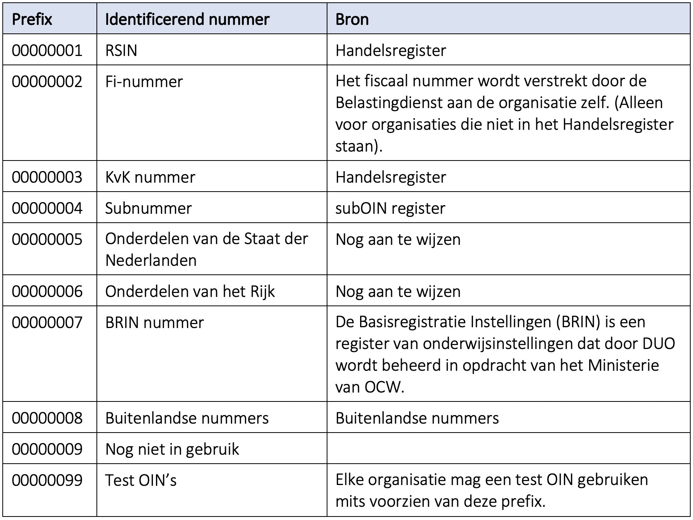

# B0516 - Identificatie van organisaties

## Situatie
We beschikken binnen de Nederlandse overheid niet over één manier om een organisatie te identificeren. Het OIN lijkt hiervoor een oplossing te bieden maar bij nadere beschouwing is dat niet het geval. Het begrip ‘OIN’ kan namelijk op twee manieren geïnterpreteerd worden:
-	Als OIN-format waarin diverse binnen de overheid gebruikte nummers worden samengebracht. Hierbij is er dus sprake van verschillende registers en niet van één register.
-	Als nummer uit het Centrale OIN Register dat door Logius wordt bijgehouden.

Ondanks deze beperkingen wordt het OIN binnen de API Designrule extensions van de Nederlandse API stategie toch aangewezen als middel om organisaties te identificeren. We nemen deze aanbeveling dan ook over in deze standaard.

## Besluit
Organisaties worden geïdentificeerd met behulp van een Overheid Identificatie Nummer (OIN). Dit OIN wordt opgesteld conform het formaat zoals beschreven in [bijlage 1 van het document Digikoppeling-Identificatie-en-Authenticatie](https://www.logius.nl/sites/default/files/public/bestanden/diensten/DigiKoppeling/Standaarden/Digikoppeling-Identificatie-en-Authenticatie.pdf)

## Toelichting

### Mogelijkheden en beperkingen van het OIN
-	ZZP’ers hebben een KvK nummer en kunnen op die manier via het OIN geïdentificeerd worden.
-	Veel bedrijven hebben zowel een RSIN als een KvK-nummer en zijn daardoor met twee verschillende OIN’s te identificeren.
-	Het handelsregister kent ook vestigingen. Deze kunnen niet opgenomen worden in het OIN-formaat. Het is dus niet mogelijk om een specifieke vestiging van een organisatie te identificeren.

### Relevante passage uit bijlage 1 van Digikoppeling-Identificatie-en-Authenticatie
Het basisformaat van het OIN - Organisatie Identificatie Nummer- is:
><prefix><nummer><suffix> 

Voor het nummer maakt Logius voor overheidsorganisaties primair gebruik van het Rechtspersonen en Samenwerkingsverbanden Identificatie Nummer (RSIN) uit het HR. In die gevallen waar een overheidsorganisatie geen RSIN heeft, kan worden uitgeweken naar alternatieven. Het RSIN is inhoudelijk gelijk aan het Fiscaal(Fi)-nummer. Om rekening te houden met een andere systematiek in de toekomst is de lengte van het prefixveld bepaald op 8 posities. De prefix definieert welk soort nummer volgt.

De waarde van het OIN in het OIN Register en in het veld subject.serialNumber is inclusief de prefix en suffix en daarbij behorende voorloopnullen. Door het gehele nummer te gebruiken wordt zeker gesteld dat het nummer uniek is. 

### Voorbeelden:
-	OIN o.b.v. RSIN: 00000001123456789000 
-	OIN o.b.v. Logius-beheerder: 00000004123456789000 

