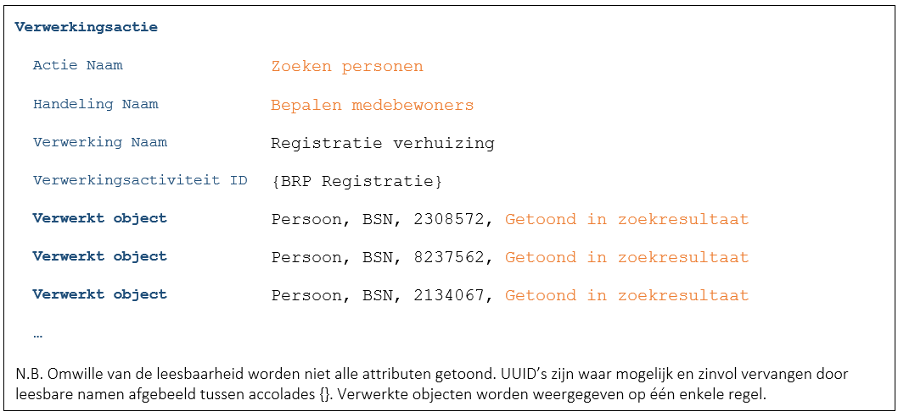

# C3209 - Zoekvraag – Vooraf gedefinieerde zoekcriteria, vooraf gedefinieerde resultaatvelden

Deze case richt zich op een voorgeprogrammeerde zoekvraag in een gemeentelijke applicatie. In een dergelijke situatie staat de zoekvraag vast en is de context bekend. Hierdoor zijn ook gegevens zoals de verwerking, de handeling en de verwerkingsactiviteit bekend. De getoonde informatie zou moeten vallen binnen de (categorieën van) gegevens zoals vermeld bij de verwerkingsactiviteit in het VAR.

Er wordt in deze casus dus een standaard actie gelogd (F7446):

Indien er in deze casus sprake was geweest van de aanroep van een dienst van een provider dan hadden zowel de consumer als de provider moeten loggen ([B7259](./7259.md)) zoals beschreven in [C9522](./9522.md) en [C2866](./2866.md).

