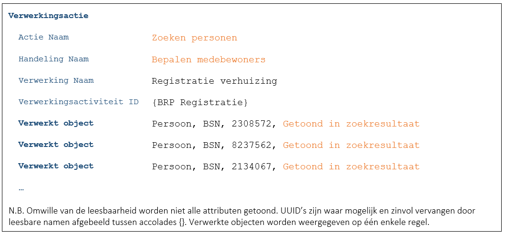

# C5889 - Zoekvraag – Onbekende zoekcriteria, vooraf gedefinieerde resultaatvelden

Het gaat in deze casus om een situatie waarbij een medewerker zelf (deels) de zoekcriteria kan bepalen. Dit levert een situatie op die, vanuit het privacy-by-design uitgangspunt, gevoeliger ligt dan situaties waarin de zoekcriteria vooraf gedefinieerd zijn door applicaties.
Er zou dispuut kunnen ontstaan waarin een burger aangeeft dat voor een bepaalde verwerking de zoekcriteria door de medewerker onvoldoende ingeperkt zijn (in relatie tot het doel van de verwerking). Denk bijvoorbeeld aan het onrechtmatig benaderen van de gegevens van bekende Nederlanders. In een dergelijke situatie kan het wenselijk zijn de gebruikte zoekcriteria te achterhalen. Er is echter besloten de zoekcriteria niet op te nemen. Zie [B0233](./0233.md) voor een toelichting op dit besluit.

Omdat we de zoekcriteria niet loggen is de verwerkingenlogging identiek aan die van andere zoekacties:

Indien er in deze casus sprake was geweest van de aanroep van een dienst van een provider dan hadden zowel de consumer als de provider moeten loggen ([B7259](./7259.md)) zoals beschreven in [C9522](./9522.md) en [C2866](./2866.md).
