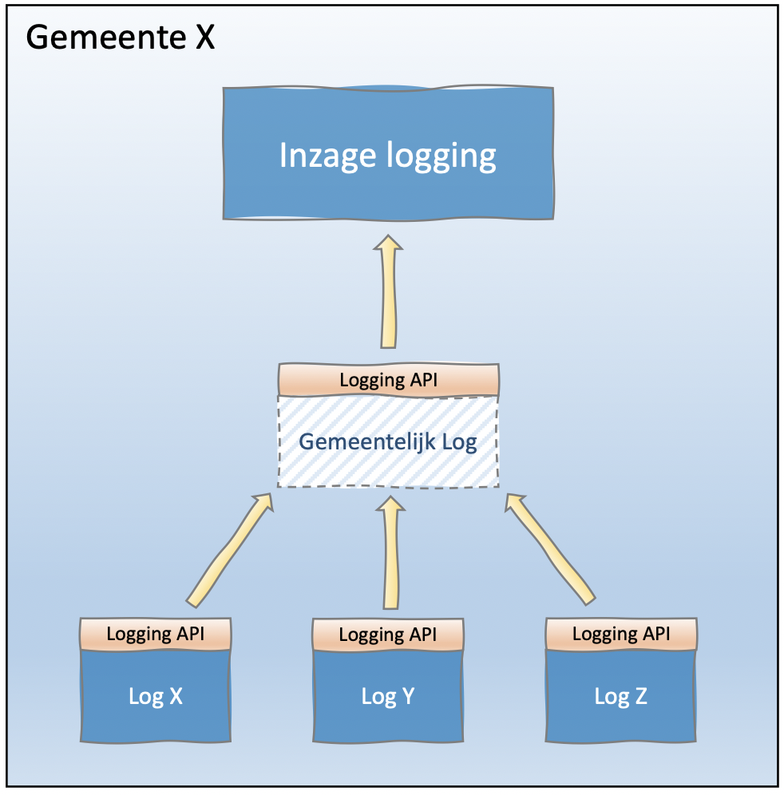

# B8970 - Benadering verwerkingenlog bij gefedereerde inrichting

## Besluit
-	Indien de verwerkingenlogging binnen een gemeente over meerdere verwerkingenlogs verspreid is, moeten al deze verwerkingenlogs de standaard verwerkingenlogging API implementeren.
-	Er zal vervolgens een ‘overkoepelende’ service nodig zijn zodat systemen die ‘het gemeentelijk verwerkingenlog’ willen benaderen dat gewoon via één service kunnen doen en de onderliggende lverwerkingenlog niet hoeven te kennen.
-	Ook de overkoepelende service moet de inzage functies van de standaard verwerkingenlogging API implementeren..

## Visualisatie

N.B. In bovenstaande afbeelding is het Gemeentelijk verwerkingenlog een ‘virtueel’ verwerkingenlog. Het is niet de bedoeling dat gegevens uit de verschillende verwerkingenlogs gekopieerd worden naar een centraal log.

## Toelichting
-	De kans is aanzienlijk dat leveranciers bij hun systeem een eigen ‘subsysteem’ leveren voor verwerkingenlogging. We hebben dit patroon eerder bijvoorbeeld ook al gezien bij gegevensmagazijnen en zaaksystemen. Het is belangrijk dat een gemeente in een dergelijke situatie dus toch van de leveranciers eist dat deze verwerkingenlogs voldoen aan de verwerkingenlogging API. Wordt deze eis niet gesteld dan zal het vanuit één punt ontsluiten van deze verwerkingenlogs bijzonder lastig worden.
-	Het kan ook zijn dat een gemeente bewust kiest voor een systeemlandschap met meerdere verwerkingenlogs. Bijvoorbeeld om privacy hotspots te voorkomen of verwerkingenlogs van gevoelige systemen anders te kunnen beveiligen etc. Ook in een dergelijke situatie dienen alle verwerkingenlogs de verwerkingenlogging API te implementeren.
