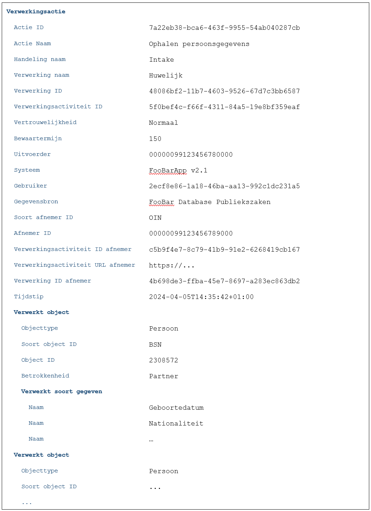
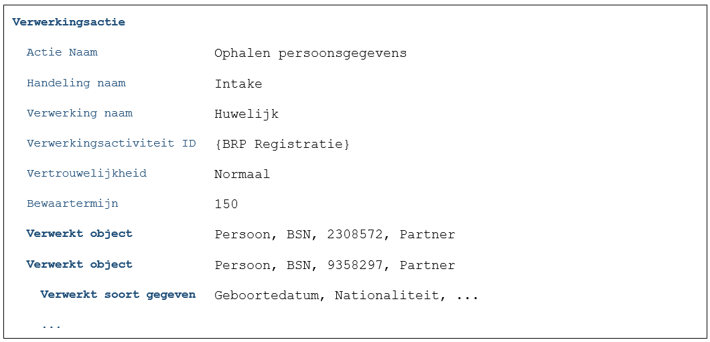

# Cases

## Algemeen
Bij het opstellen van het ontwerp van de Verwerkingenlogging API-standaard zijn diverse cases uitgeschreven. Doel van deze cases is de werking van de logging van verwerkingen en de relatie met een gemeentelijk verwerkingsactiviteitenregister zodanig te doorgronden dat duidelijk wordt:
- Welke ontwerpvraagstukken er spelen.
- Wat de potentiele impact van die vraagstukken is op architectuur, functionaliteit, niet functionele aspecten (NFR’s), gegevensmodel en API’s.
- Wat een handige volgorde zou kunnen zijn om de vraagstukken aan te pakken. Hiermee hopen we te voorkomen dat we in latere iteraties van de API-standaard opeens ‘de fundering’ opnieuw moeten aanleggen.

Om dit te kunnen doen worden in de cases waar nodig ook niet functionele aspecten die impact kunnen hebben betrokken zoals niet functionele requirements en implementatie aspecten. Er wordt daarom bewust niet over 'Use Cases' of 'User Stories' gesproken. Daarvoor is het format dat gebruikt wordt te informeel. Bij cases die een variant op een eerder case zijn, worden alleen de verschillen uitgewerkt.

## Groepering van cases
De cases zijn gegroepeerd op basis van de verschillende soorten patronen die voorkomen in de bedrijfsprocessen van gemeenten. Per groep wordt bekeken wat de impact is op een gemeentelijk verwerkingsactiviteitenregister en verwerkingenlogregister. Iedere groep van cases is ondergebracht in een aparte categorie. In de tabel hieronder volgt een korte toelichting op de categorieën.

- [Bijhouden van gegevens](./cases/Bijhouden_van_gegevens.md) - Gemeenten muteren op verschillende manieren gegevens. Muteren kan plaatsvinden via schermen en webservices. Zaakgericht en niet-zaakgericht.
- [Opvragen van gegevens](./cases/Opvragen_van_gegevens.md) - Opvragen van gegevens in alle varianten. Binnen de gemeente, door een derde en bij een derde.
- [Leveren van gegevens](./cases/leveren_van_gegevens.md) - Levering van gegevens binnen de gemeente of aan derden. Het initiatief ligt bij (het informatie verwerkende proces van) de gemeente.
- [Delegatie en mandatering](./cases/delegatie_en_mandatering.md) - Welke invloed heeft het delegeren of mandateren van verwerkingen op het verwerkingenlog.
- [Vertrouwelijke verwerkingen](./cases/vertrouwelijke_verwerkingen.md) - Onderzoeken van bijvoorbeeld inlichtingendiensten mogen niet zichtbaar zijn zolang deze lopen. Daarnaast is het in het kader van de privacy ongewenst dat allerlei mensen – ook na afronding van de onderzoeken – kunnen zien dat dit soort onderzoeken hebben plaatsgevonden. 
- [Privaatrechtelijke verwerking](./cases/privaatrechtelijke_verwerkingen.md) - Hoe loggen we dit? Hoe gaan we om met situaties waarin expliciete toestemming nodig is?
- [Bewaartermijnen](./cases/bewaartermijnen.md) - Verwerkingenlogs dienen geschoond te worden na afloop van de bewaartermijn. Welke termijnen zijn er en hoe gaan we daarmee om?
- [Inzage in het log](./cases/inzage_in_log.md) - Op welke wijze kunnen burgers, medewerkers en derden inzage krijgen in het verwerkingenlog?
- [Bijzondere rechten in de AVG](./cases/bijzondere_rechten.md) - Cases over bijzondere rechten zoals het recht op rectificatie en gegevenswissing.
- [Overige cases](./cases/overige_cases.md) - Overige cases die niet in de andere groeperingen onder te brengen zijn.

## Beschrijving van te loggen/gelogde acties in cases
Onderstaande voorbeeld toont een actie zoals deze doorgegeven zou worden aan de verwerkingenlogging API:

In de diverse ontwerpartefacten gebruiken we een compacte beschrijving. Hierin zijn omwille van de leesbaarheid de volgende veranderingen doorgevoerd:
-	Alleen de voor het voorbeeld of besluit relevante attributen worden getoond.
-	UUID’s worden waar mogelijk en zinvol vervangen door leesbare namen. Om duidelijk te maken dat het hier eigenlijk om een verwijzing gaat staan deze namen tussen accolades.
-	Verwerkt object en Verwerkt soort object worden weergeven op één regel waarbij de waarden door komma’s worden gescheiden.

Een voorbeeld van een compacte beschrijving:

