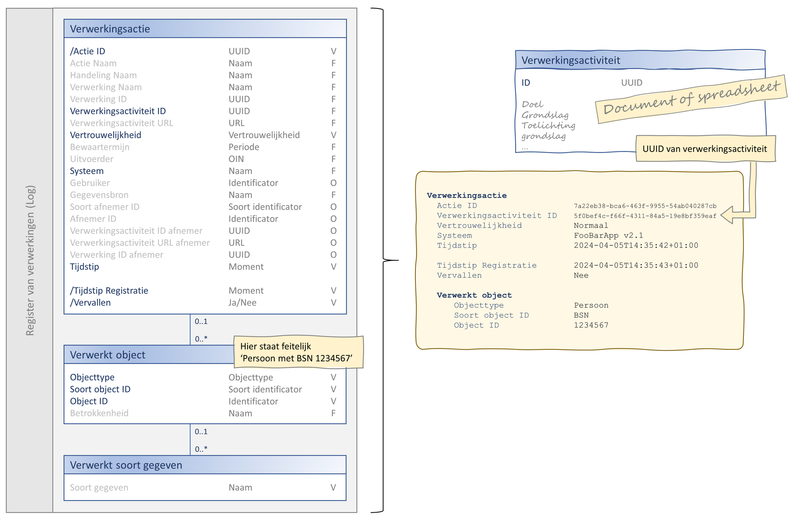
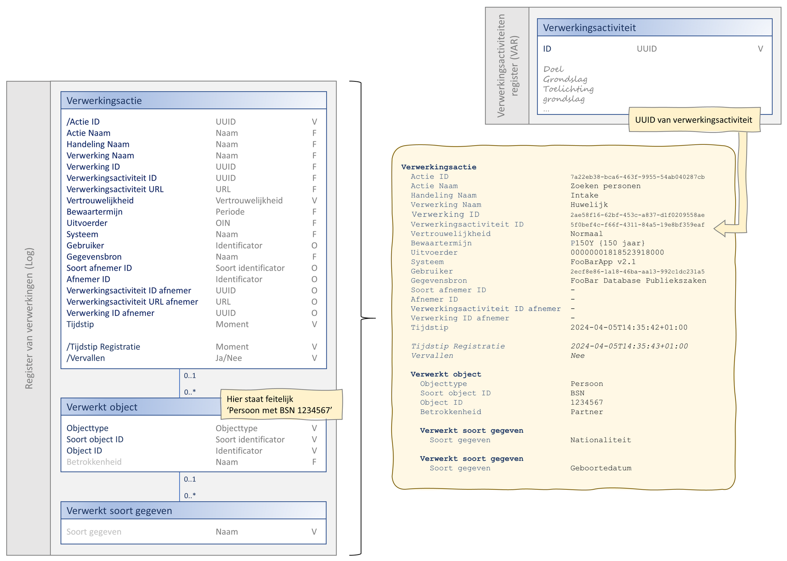

# Volledigheid van verwerkingenlogging

## Introductie
De API-standaard kan doordat de meeste attributen in het uitwisselgegevensmodel optioneel zijn eenvoudig worden geimplementeerd. Hoe meer veldden worden ingevuld hoe zinvoller de informatie die wordt vastgelegd is en hoe duidelijker de informatie voor de burger is. Het streven moet dus zijn zoveel mogelijk attributen vast te leggen. 

## Minimale versus maximale verwerkingenlogging
Onderstaande afbeelding toont verwerkingenlogging in zijn meest basale vorm.

-	Het gemeentelijk VAR is nog geen informatiesysteem maar een document of spreadsheet. De verwerkingsactiviteiten in het VAR zijn al wel voorzien van een uniek ID ([UUID](../gegevenswoordenboek/attribuuttypen/UUID.md)) zodat er vanuit het verwerkingenlog naar het VAR verwezen kan worden.
-	Vanuit de gedachte ‘beter iets dan niets loggen’ worden van het [uitwisselingsgegevensmodel](../gegevensmodel/uitwisselingsgegevensmodel.md) alleen de meest basale attributen gebruikt. Dit zal niet leiden tot een voor de burger begrijpelijk verwerkingenlog maar het is een begin en beter dan niets.

Ter vergelijking laat onderstaande afbeelding een voorbeeld zien van het maximale gebruik van verwerkingenlogging.

-	Het VAR is een informatiesysteem.
-	Van het [uitwisselingsgegevensmodel](../gegevensmodel/uitwisselingsgegevensmodel.md) worden alle attributen gebruikt. Dit zal leiden tot een veel begrijpelijker verwerkingenlog voor de burger.
-	Bij volledige implementatie van de API is het nu mogelijk om:
    - Bewaartermijnen die later in een proces bekend worden te registreren.
    - De vertrouwelijkheid van verwerkingen op te heffen.
    - De verwerkingenlogging over bepaalde verwerkingen logisch te verwijderen.
    - Et cetera.
    
